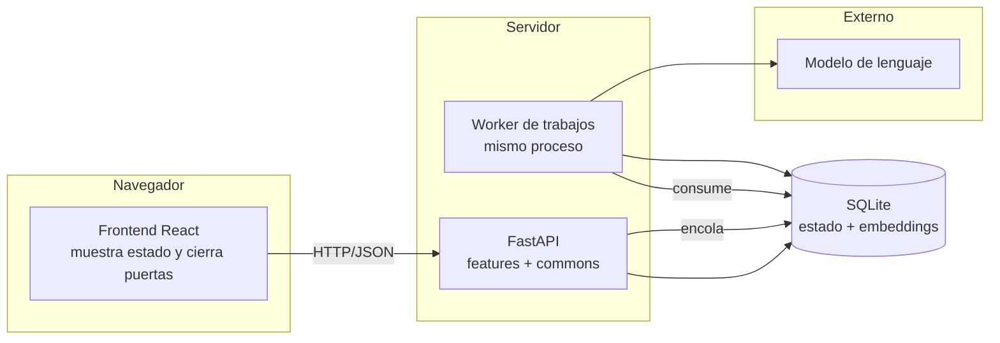
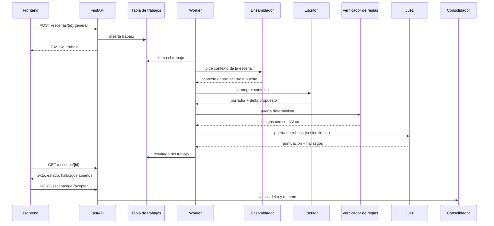

# Arquitectura — My_novel_story

2026-09-21 · @Santiago Espinosa Domínguez

Cómo se construye el sistema que escribe la novela: el reparto frontend/backend, la
estructura de carpetas, los agentes del pipeline con sus habilidades y el proceso que
recorre una escena desde que se planifica hasta que se consolida.

## Qué manda sobre qué

Este documento no es normativo sobre el dominio ni sobre el stack. Desarrolla el *cómo*
de decisiones que se toman en otro sitio.

| Pregunta | Documento que manda | Papel de este documento |
| --- | --- | --- |
| Qué tecnología se usa y cuánto contexto cabe | `CLAUDE.md` | No repite sus tablas. Las referencia y explica cómo se implementan |
| Qué clases, atributos, enumeraciones e invariantes existen | `Docs/definitions.md` | No define ninguna. Dice qué componente ejecuta cada `INV-xx` |
| Cómo se ve el modelo de un vistazo | `Docs/domain-knowledge.md` | Es una vista del dominio; aquí los diagramas son del sistema |
| Cómo se organiza el código y quién habla con quién | **este documento** | Fuente |

Si una tabla de aquí contradice a `CLAUDE.md`, gana `CLAUDE.md` y esta se corrige. Si un
nombre de clase o de enumeración de aquí no está en `Docs/definitions.md`, es un error de
este documento, no una extensión del modelo.

## Qué se ha recogido de los documentos de dominio

El encargo era separar de `Docs/definitions.md` y `Docs/domain-knowledge.md` lo que no es
estrictamente definición ni conocimiento de dominio. Esto es lo que se ha identificado y
se desarrolla aquí.

**La limpieza sigue pendiente (`A-08`).** El contenido queda por ahora duplicado a
propósito: borrar de los originales y dejar un puntero es un cambio aparte que todavía no
está hecho, y mientras no se haga, la copia de referencia sigue siendo la del documento
original. De los originales se han tocado dos cosas, y ninguna mueve el
contenido duplicado: correcciones documentales —rutas, literales de un diagrama, una
arista mal nombrada— y los cambios de dominio que aplicaron `SPEC-02`, `SPEC-03` y
`SPEC-04`, que pasaron por su propia puerta. La duplicación que describe `A-08` sigue
intacta.

| Origen | Fragmento | Por qué no es definición ni dominio |
| --- | --- | --- |
| `definitions.md` | Tabla "Jerarquía de memoria" | Es el diseño del ensamblador de contexto. Las clases `Ficha`, `Resumen` y `AnclaDeEstilo` sí son dominio; repartirlas en niveles con presupuesto es arquitectura |
| `definitions.md` | Párrafo de los "tres mecanismos" (delta, anclas de estilo, ventana de coherencia frente a ventana de continuidad) | Justificación de diseño: explica por qué el sistema está montado así, no qué es verdad en la ficción |
| `definitions.md` | Sección "Verificadores por tipo" | Reparto de implementación: qué comprueba código, qué comprueba un modelo y qué comprueba una persona |
| `definitions.md` | "Cada invariante debe tener al menos un caso de prueba negativo" | Política de pruebas del harness |
| `definitions.md` | Sección "Decisiones abiertas" | Registro de decisiones. Su sitio natural es `Docs/decisions/`, que aún no existe |
| `definitions.md` | Párrafos de justificación en negrita ("La curva de dread evita el fallo más común…", "El registro de conocimiento merece rango propio") | Argumentan la decisión de modelado; la definición es la fila de la tabla, no el párrafo |
| `domain-knowledge.md` | Diagrama "Generación de una escena" | Arquitectura pura: `Orquestador`, `Memoria`, `Generador` y `Verificadores` no son clases de `Docs/definitions.md`. Ningún diagrama de dominio debería introducir participantes que el modelo no define |
| `domain-knowledge.md` | Diagrama "Ciclo de vida de una escena" | Mitad y mitad: los estados **son** dominio (enumeración `estado_de_escena`), pero quién dispara cada transición es orquestación |
| `domain-knowledge.md` | Nota "La rama de memoria es la que decide si el sistema escala" | Justificación de diseño |

**Defecto corregido.** `Docs/domain-knowledge.md` apuntaba en su segundo párrafo a
`project/697dd43c-600e-4664-a8ce-d8e6c08b6b8f`, un identificador de proyecto externo que
para cualquiera que leyera el repositorio era un enlace roto. Ahora apunta a
`Docs/definitions.md` y dice explícitamente que los diagramas son una vista de ese
documento.

## El sistema

Dos piezas desplegables y una base de datos. Nada más.



La frontera es estricta: el frontend nunca toca la base de datos y nunca calcula nada del
dominio. El cambio de valor de una escena, la curva de dread y el estado de las
invariantes llegan resueltos desde la API. Si el frontend necesitara calcular algo para
pintarlo, falta un campo en la respuesta.

### Backend — FastAPI

**Decisión: una carpeta por feature, más una carpeta `commons` para lo compartido.** Una
feature es un **caso de uso del pipeline**, no un plano del dominio ni una entidad. El
criterio es que una feature se pueda ejecutar, probar y romper sola.

```
backend/
  app/
    main.py                  # monta los routers de cada feature
    commons/
      config.py              # configuración y presupuesto de contexto
      db/                    # motor SQLite, extensión vectorial, migraciones versionadas
      dominio/               # Enums de los vocabularios controlados y modelos Pydantic base
      modelo/                # cliente del LLM, conteo de tokens, control de presupuesto
      invariantes/           # registro INV-01..INV-16, severidad, resultado tipado
      trabajos/              # tabla de trabajos, worker, estados de un trabajo
      errores.py
    features/
      brief/                 # alta de la obra: premisa, tono, guia de estilo, prohibiciones
      escaleta/              # plan de escenas antes de escribir
      contexto/              # ensamblado del contexto de una escena dentro del presupuesto
      generacion/            # producir borrador + delta propuesto
      verificacion/          # puertas: reglas deterministas y jueces
      revision/              # pases dirigidos sobre texto ya generado
      consolidacion/         # aplicar el delta y resumir
      auditoria/             # invariantes de nivel obra y capitulo
      orquestacion/          # compone las anteriores; unica autorizada a hacerlo
      lectura/               # consultas de solo lectura que alimentan el frontend
```

**La raíz de estas rutas es `backend/app/`, y se escriben relativas a ella.** Cuando
cualquier documento del proyecto cita `commons/invariantes/` o `features/contexto/tests/`,
se refiere a `backend/app/commons/invariantes/` y a `backend/app/features/contexto/tests/`.
El prefijo se declara aquí y no se repite: escribirlo en cada cita serían decenas de
copias del mismo dato, y la próxima vez que `app/` se mueva divergirían una a una. `VER-45`
resuelve las rutas contra esta raíz.

Cada feature tiene la misma forma, y siempre los mismos ficheros:

| Fichero | Contiene |
| --- | --- |
| `router.py` | Endpoints. Sin lógica: valida, llama al servicio y devuelve |
| `schemas.py` | Modelos Pydantic de entrada y salida. Frontera de validación |
| `service.py` | La lógica del caso de uso |
| `repository.py` | Acceso a datos. Es el único que ve SQL |
| `agente.py` | El prompt y el contrato del agente, si esta feature tiene uno |
| `tests/` | Incluye el caso negativo de cada invariante que esta feature comprueba |

**Reglas de dependencia**, que son lo que hace que la estructura valga para algo:

1. Una feature **nunca** importa de otra feature. Si dos la necesitan, se sube a `commons`.
2. `commons` **nunca** importa de una feature. La flecha va en un solo sentido.
3. `orquestacion/` es la única excepción a la regla 1: existe precisamente para componer
   features en un proceso. Sin esa excepción, la coordinación se colaría por las rendijas
   y acabaría repartida entre todas.
4. Los `Enum` de los vocabularios controlados viven en `commons/dominio/` y en ningún otro
   sitio. Un valor fuera de la enumeración es un error de validación, no un aviso.

### Frontend — React

**Decisión: el frontend mira y además cierra las puertas.** No es solo un panel: es donde
la persona ejecuta las transiciones de la máquina de estados. Una puerta sin interfaz para
cerrarla es teatro, porque todo pasa cuando no hay nadie que la cierre.

| Vista | Qué muestra | Qué deja hacer |
| --- | --- | --- |
| Obra | Estructura de partes y capítulos, progreso, curva de dread | Navegar |
| Escena | Texto, estado (`planificada`…`consolidada`), delta propuesto, hallazgos abiertos | Lanzar generación, aceptar, rechazar, pedir reescritura |
| Puertas | Resultado de cada invariante con su identificador y severidad | Cerrar la puerta o devolver la escena |
| Continuidad | Estado del mundo en `t`, registro de conocimiento, presagios sin pagar | Consultar |
| Trabajos | Trabajos en curso y su estado | Seguir un trabajo por su identificador |

Dos reglas de presentación:

- Una escena **nunca** se muestra sin su estado y sin sus hallazgos abiertos. Un texto
  suelto induce a darlo por bueno, que es exactamente el fallo que las puertas evitan.
- Un dato que no se ha medido se muestra como **"sin medir"**, nunca como cero. Un cero se
  lee como una medición; un hueco se lee como lo que es.

**Decisión: el frontend se organiza con Feature-Sliced Design (FSD) v2.1.** Es la
contraparte de A-01 en el navegador, y trae el criterio que al backend se lo da la regla
de features: dónde va cada fichero y quién puede importar a quién.

```
frontend/src/
  app/          # arranque, providers, enrutado
  pages/        # composición por ruta: Obra, Escena, Puertas, Continuidad, Trabajos
  features/     # interacciones reutilizables: aceptar, rechazar, pedir reescritura
  entities/     # modelos de dominio reutilizables: escena, hallazgo, personaje
  shared/       # cliente de la API, componentes sin lógica de negocio, utilidades
```

Tres cosas que conviene no perder de vista:

1. **`shared/` es el equivalente frontend de `commons/`.** Infraestructura sin lógica de
   negocio: el cliente de la API, el sistema de componentes, las utilidades.
2. **La regla de importación es más estricta que en el backend.** Un módulo solo importa
   de capas **estrictamente inferiores**, y los cross-imports entre slices de la misma
   capa están prohibidos. En el backend hay una excepción (`orquestacion/`); aquí no la
   hay, porque la composición ya tiene su capa, que es `pages/`.
3. **No se crean capas vacías por si acaso.** FSD v2.1 recomienda empezar con `shared/`,
   `pages/` y `app/`, y extraer a `features/` o `entities/` solo cuando el mismo código se
   usa ya en varios sitios, tiene una razón de cambio propia y una responsabilidad
   acotada. La capa `widgets/` está desaconsejada por la metodología y no se usa.

La skill oficial de FSD está instalada en el repositorio
(`.agents/skills/feature-sliced-design/`) y es la que manda sobre las dudas de colocación.

### Persistencia — SQLite con soporte vectorial

Una sola base de datos guarda el estado estructurado, los embeddings y la cola de
trabajos. No hay servicio de vectores aparte ni cola externa.

- Se indexan por similitud: fichas de entidad, resúmenes de escena y presagios pendientes.
- El texto completo de las escenas se guarda pero **no** se recupera por similitud. Para
  eso están los resúmenes. Nunca se manda la obra entera al modelo.
- El estado del mundo se reconstruye acumulando los deltas de escena en orden. No se relee
  el texto para averiguar qué pasó.
- Las migraciones se versionan. Un cambio en `Docs/definitions.md` que altere un atributo
  obligatorio necesita su migración en el mismo commit.

**Decisión: la cola de trabajos es una tabla de esta misma base.** Generar una escena
tarda, así que el endpoint inserta una fila en `trabajo`, devuelve su identificador y no
bloquea; un worker del mismo proceso la consume. Con la cola en memoria, un reinicio a
mitad de escena pierde el trabajo en silencio; con la cola en la tabla, sobrevive y el
frontend lo sigue por su identificador.

## Agentes del pipeline

**Decisión: un agente es una llamada al modelo con su propio contexto, su propio prompt y
su propia salida tipada.** Sale más caro en llamadas, y a cambio el Escritor no ve las
rúbricas del Juez, cada salida se valida por separado y un fallo se atribuye a un agente
concreto en vez de a "la generación".

No todo lo que participa en el proceso es un agente. Lo que se puede comprobar con código
se comprueba con código: pedírselo a un modelo es más caro, más lento y menos fiable.

| Agente | ¿Llama al modelo? | Habilidades | Entrada → Salida | Invariantes que toca |
| --- | --- | --- | --- | --- |
| **Orquestador** | No | Aplicar la máquina de estados; decidir la siguiente transición legal; detener en puerta bloqueante | Estado de la escena → transición | `INV-05` (que el delta esté aplicado antes de seguir) |
| **Escaletador** | Sí | Repartir el cambio de valor por escena; prever la curva de dread; asignar beats a arcos | `Brief` + `GuiaDeEstilo` → `Escaleta` | `INV-01`, `INV-07`, `INV-12`, `INV-16` en su forma prevista |
| **Ensamblador de contexto** | No | Recuperar por similitud; seleccionar fichas y setups pendientes; recortar por nivel de prioridad; contar tokens | Escena planificada → contexto dentro del presupuesto | Ninguna; hace cumplir el límite de `CLAUDE.md` |
| **Escritor de escena** | Sí | Escribir la escena; sostener el POV; respetar las anclas de estilo; **devolver el delta estructurado en la misma llamada** | Contexto → `Borrador` + `DeltaDeEscena` | Produce el material de `INV-01`…`INV-04` |
| **Verificador de reglas** | No | Continuidad de entidades; coherencia cronológica; **comparación contra el registro de conocimiento en `t`**; repetición léxica; distribución de longitud de frase | Borrador + delta + estado → `Hallazgo[]` | `INV-01`, `INV-02`, `INV-03`, `INV-04`, `INV-07`, `INV-13` (incremental) |
| **Juez de rúbrica** | Sí | Puntuar con `Rubrica`: función dramática, credibilidad del diálogo, eficacia del presagio, adecuación al POV, calidad del cambio de valor | Borrador + rúbrica → puntuación + `Hallazgo[]` | `INV-10`. Como desempate: `INV-03`, `INV-11`, `INV-14` |
| **Revisor** | Sí | Un `PaseDeRevision` por tipo: continuidad, voz, ritmo, densidad, línea | Borrador + hallazgos → borrador nuevo | Las del hallazgo que corrige |
| **Resumidor** | Sí | Condensar escena → capítulo → parte; extraer hechos clave; actualizar fichas de entidad | Escena consolidada → `Resumen`, `Ficha` | Ninguna; es lo que hace que el sistema escale |
| **Consolidador** | No | Aplicar el delta al estado; detectar delta incompatible; reindexar embeddings | Delta aceptado → `EstadoDelMundo(t+1)` | `INV-05`, `INV-06` |
| **Auditor de obra** | Mixto | Comprobaciones de nivel obra y capítulo, que no se pueden hacer escena a escena | Obra completa → `Hallazgo[]` | Obra: `INV-06`, `INV-09`, `INV-11`, `INV-12`, `INV-13`, `INV-14`, `INV-16`. Capítulo: `INV-08`, `INV-15` |

**Qué significa «en su forma prevista».** El Escaletador comprueba `INV-01`, `INV-07`,
`INV-12` e `INV-16` **contra la `Escaleta`, antes de que exista ningún texto**: que cada
escena planificada tenga su `cambio_de_valor`, que sus beats sirvan a un arco, y que la
curva de dread prevista tenga su máximo en el clímax y varianza suficiente. Es la misma
invariante sobre el plan en vez de sobre la obra, y por eso no sustituye a la comprobación
del Auditor: un plan correcto que se ejecuta mal sigue fallando, y quien lo caza es el
barrido final sobre la curva realizada.

**Por qué el Verificador de reglas no comprueba invariantes de nivel obra.** Su entrada es
una escena —borrador, delta y estado en `t`—, y `INV-09`, `INV-12` e `INV-16` no se pueden
contestar desde ahí: un presagio es huérfano solo cuando la obra termina sin pagarlo, y el
máximo y la varianza de la curva necesitan la serie entera. `INV-06` tampoco es suya: su
forma incremental —que el delta no contradiga el estado en `t`— es del Consolidador, y así
lo dice `RF-20` de `SPEC-01`. Las cuatro son del Auditor de obra.

**`INV-13` es la excepción, y a propósito: se comprueba dos veces.** El Verificador hace la
forma **incremental** —si esta escena revela un hecho que ya estaba revelado, lo dice en la
escena donde ocurre, que es cuando todavía se puede corregir sin rehacer nada— y el Auditor
hace el **barrido** sobre la obra, que es la red por si el incremental falló. No es
duplicación: son dos momentos distintos con dos costes de corrección distintos.

Como los dos pueden levantar un `Hallazgo` de `INV-13`, **hay que poder distinguir cuál
fue**. El dominio ya lo permite: `Hallazgo.verificador` es un atributo obligatorio. Lo que
faltaba era comprobarlo, y eso es la fila `VER-12` de `Docs/verification.md`.

**`INV-05` no es del Verificador.** La tiene el Orquestador —que no deja pasar a la escena
siguiente sin delta aplicado— y el Consolidador, que es quien lo aplica. La del Verificador
estaba a pelo, sin razón escrita, y era duplicación sin función. Si alguien la quiere de
vuelta, que la escriba con su motivo.

**Decisión: el Juez no comparte sesión con el Escritor.** Recibe el texto y la rúbrica, no
el prompt ni el razonamiento que produjeron ese texto. Un modelo que juzga su propia
salida con su propio contexto delante tiende a aprobarla. Modelo distinto si se puede;
sesión limpia como mínimo.

### Presupuesto de contexto por agente

El límite duro y el reparto por nivel de memoria están en `CLAUDE.md` y no se repiten
aquí. Lo que sí es arquitectura es **qué niveles recibe cada agente**, porque no todos
necesitan todos.

**Aquí aparecen solo los agentes que llaman al modelo**, porque son los únicos que
consumen el presupuesto de contexto y esta tabla reparte ese presupuesto. El Orquestador,
el Consolidador y el Verificador de reglas no mandan ningún prompt: lo que necesitan para
trabajar está en su columna de habilidades, no aquí. Y el Ensamblador de contexto no
recibe niveles, los **construye**. El criterio se escribe porque estaba implícito, y un
criterio implícito no impide que alguien añada una fila que no le corresponde.

| Agente | Inmutable | Estado actual | Local | Recuperado | Resúmenes |
| --- | --- | --- | --- | --- | --- |
| Escaletador | sí | sí | no | sí | sí |
| Escritor de escena | sí | sí | sí | sí | según profundidad |
| Juez de rúbrica | guía de estilo y anclas | no | escena anterior | no | no |
| Revisor | sí | sí | sí | solo lo que cita el hallazgo | no |
| Resumidor | no | no | la escena que resume | no | los del nivel inferior |
| Auditor de obra | anclas de estilo | sí | la escena que se desempata | setups pendientes | sí, todos |

**El Auditor recibe resúmenes porque es lo que cabe en un prompt, no porque sea lo único
que puede leer.** Esta tabla reparte lo que se **envía** al modelo; sus comprobaciones son
de tipo `regla`, y una regla consulta la base. `INV-15` mide la distancia estilométrica
sobre la prosa real del capítulo sin tocar el presupuesto, y `INV-09` compara filas de
`Presagio` —que tienen `escena_de_plantado` y `escena_de_pago` propios—, no líneas de un
resumen: una condensación que se deje un presagio no esconde nada.

Recibe `Estado actual` por `INV-06`, que compara hechos vigentes entre sí; `Recuperado`
por los setups pendientes de `INV-09`; y del nivel inmutable solo las anclas de estilo,
que es contra lo que `INV-15` mide la distancia. De `Local` recibe **solo la escena que se
desempata**: es `Mixto` porque `INV-11` e `INV-14` son suyas y escalan al juez, y los dos
desempates preguntan por el texto —si una reversión está justificada, si una revelación
implícita cuenta—, así que necesita esa escena y no la obra entera.

El reparto numérico de tokens entre agentes **no está fijado y no se inventa aquí**. Se
fija cuando haya medidas reales de cuánto consume cada uno; hasta entonces cada agente usa
el presupuesto por nivel de `CLAUDE.md`. **Caduca con:** `backend/`.

**La regla de recorte no se reenuncia aquí: vive en `CLAUDE.md` § "Límite de contexto" y
este documento la usa, no la redefine.** La precedencia de `AGENTS.md` ya dice que en lo
técnico manda `CLAUDE.md`, así que repetirla era una copia sin autoridad. Y era una copia
con consecuencia: `SPEC-01` §2.4 va a corregir esa regla y declara que modifica
`CLAUDE.md`, sin mencionar este documento, de modo que la corrección habría entrado a
medias y habría dejado los dos textos diciendo lo contrario.

## El proceso

### Una escena, de principio a fin



Dos cosas que el diagrama fija y conviene no perder de vista. El Escritor devuelve **dos**
cosas en la misma llamada, texto y delta: pedir el delta después, releyendo la escena, es
más caro y menos fiel. Y la aceptación la dispara la persona desde el frontend, no el
worker: la puerta la cierra alguien.

### La máquina de estados y quién dispara cada transición

Los estados son los de la enumeración `estado_de_escena` de `Docs/definitions.md`. Lo que
añade este documento es la columna de quién los mueve.

| Transición | Quién la dispara | Condición |
| --- | --- | --- |
| `planificada` → `generada` | Worker | El Escritor devuelve borrador y delta |
| `generada` → `en_verificacion` | Orquestador | Automática |
| `en_verificacion` → `rechazada` | Verificador de reglas | Falla una invariante `bloqueante` |
| `en_verificacion` → `en_revision` | Juez de rúbrica | Hallazgo `mayor` o `menor` |
| `en_verificacion` → `aceptada` | Orquestador | Pasa todas las puertas |
| `rechazada` → `generada` | Persona desde el frontend | Regeneración |
| `en_revision` → `generada` | Revisor | Reescritura dirigida |
| `aceptada` → `consolidada` | Consolidador | Delta aplicado sin conflicto |

La transición que importa es `aceptada → consolidada`. Hasta que el delta no está
aplicado, el estado del mundo no ha cambiado y la escena siguiente **no puede generarse**:
es ahí donde se corta la propagación del error.

#### El capítulo tiene su propia transición

Los estados de capítulo son los de `estado_de_capitulo`, no los de `estado_de_escena`, así
que van en su propia tabla: mezclar las dos escalas en una sola invita a comparar valores
que no pertenecen al mismo vocabulario.

| Transición | Quién la dispara | Condición |
| --- | --- | --- |
| `abierto` → `cerrado` | **Cliente de la API** | Todas las escenas del capítulo están `consolidada` y ninguna tiene un hallazgo `mayor` abierto |

Los hallazgos `menor` abiertos **no bloquean el cierre**: se listan al firmar, para que
quien cierra sepa qué deja pasar. Los `resuelto` y los `descartado` tampoco cuentan; para
eso existe `descartado`.

Es la **segunda puerta con firma humana** del sistema, junto con la aceptación de escena de
`A-04`, y es la que da sentido a la primera. Al decidir que un hallazgo `mayor` no detiene
la escena, el control no desapareció: se movió aquí, que es donde una persona puede juzgar
si el conjunto se sostiene. Sin esta puerta, un hallazgo `mayor` se quedaba sin ninguna
consecuencia.

### Severidad: bloqueante frente a mayor y menor

La diferencia se implementa una vez, en `commons/invariantes/`, y no se resuelve caso por
caso en cada verificador:

- **`bloqueante`** detiene la escena en la puerta. No pasa a `aceptada`.
- **`mayor`** y **`menor`** generan `Hallazgo` y dejan seguir, pero el hallazgo queda
  abierto y el frontend lo muestra junto al texto.
- La diferencia entre `mayor` y `menor` está **una puerta más arriba**: un `mayor` abierto
  impide cerrar el capítulo, un `menor` solo se lista al firmar. Sin esa puerta las dos
  severidades producirían exactamente el mismo comportamiento, y una escala cuyos valores
  no se distinguen en nada es una etiqueta, no un control.

Todo hallazgo cita su invariante por identificador (`INV-07`), nunca por descripción.

### Los estados de un trabajo

La tabla de trabajos **no es dominio**: no existiría si la novela se escribiera a mano, y
por eso vive en `commons/trabajos/` y su vocabulario se declara aquí y no en
`Docs/definitions.md`. Sigue las mismas reglas de nombres —ASCII, `snake_case`— porque es
el mismo código leyendo el mismo tipo de valor, y dos convenciones para lo mismo es como
`juez LLM` acabó divergiendo de `juez_llm`.

| Estado | Qué significa |
| --- | --- |
| `en_cola` | Encolado y sin tomar |
| `esperando_presupuesto` | Tomado, pero no hay techo de contexto disponible (`P-3`) |
| `en_curso` | Con presupuesto reservado y llamada en vuelo |
| `terminado` | Acabó y dejó su resultado |
| `fallido` | Acabó mal, y **se sabe cómo**: fallo de contrato, o tope de reintentos agotado |
| `abandonado` | Un worker lo tomó y no se supo más de él. **No se sabe si llegó a pasar** |

**`fallido` y `abandonado` no son el mismo hecho**, y por eso son dos estados y no un
estado con un campo. Uno significa que sabemos qué pasó; el otro, que no sabemos si llegó
a pasar. La consecuencia práctica está en el tope: un `abandonado` no cuenta contra él,
porque no es un intento que falló sino uno cuyo resultado se desconoce. Con un campo en
lugar de un estado, una interfaz que solo mire el estado los confunde y alguien lo relanza
a mano creyendo que falló, que es pagar dos veces por otra puerta.

| Transición | Quién la dispara | Condición |
| --- | --- | --- |
| `[*]` → `en_cola` | Cliente de la API | Se encola el trabajo |
| `en_cola` → `en_curso` | Worker | Lo toma y hay techo disponible |
| `en_cola` → `esperando_presupuesto` | Worker | Lo toma y **no** hay techo (`P-3`) |
| `esperando_presupuesto` → `en_curso` | Worker | Se libera techo |
| `en_curso` → `terminado` | Worker | La llamada devuelve algo válido |
| `en_curso` → `en_cola` | Worker | Fallo **de transporte** y tope no agotado: reintenta desde el ensamblado |
| `en_curso` → `fallido` | Worker | Fallo **de contrato**, o tope agotado |
| `en_curso` → `abandonado` | *(sin decidir: ver Decisiones abiertas)* | Se excedió el margen desde que se tomó |
| `abandonado` → `en_cola` | Persona | Relanzamiento manual, viendo qué pasó |

Se vuelve a `en_cola` y no a `en_curso` al reintentar porque se reintenta **el trabajo
entero desde el ensamblado del contexto**: entre un intento y el siguiente el estado del
mundo pudo cambiar.

### La traza de una llamada al modelo

`T-1` y `T-2` de `SPEC-01` piden traza de cada llamada, incluidas las que fallan. Qué
registra:

- El agente, la escena y el trabajo.
- El **`prompt_hash`**. Vive también aquí y no solo en `Borrador`, porque una llamada
  fallida no produce ningún `Borrador` y es justo la que hay que diagnosticar.
- **Los identificadores que entraron en el contexto**, no su texto: qué fichas con su
  `version_en_t`, qué presagios, qué resúmenes y qué niveles. Guardar el contexto entero
  sería duplicar hasta 80.000 tokens que se reconstruyen desde el estado; guardar los ids
  cuesta nada y es lo que hace la reconstrucción **posible**, porque el índice vectorial
  crece al consolidar y los empates de una consulta KNN no tienen orden definido: sin los
  ids no se sabe cuáles entraron, aunque su contenido siga ahí.
- Los tokens, en los dos campos de abajo.
- El resultado. Si fue un fallo de contrato, **la salida entera**: es pequeña, no se
  reconstruye, y es lo único que permite diagnosticar un delta fuera de esquema.

**El `prompt_hash` detecta, no reconstruye.** Sirve para saber si una reconstrucción es
fiel, no para recuperar lo que se mandó. Por eso no sustituye a los identificadores.

#### Por qué la traza lleva los tokens en dos campos

`VER-41` reconcilia lo que registra la traza contra lo que declara el modelo, y es **la
segunda fuente independiente que exige la Regla 3** de `Docs/verification.md`. Si los dos
números salen del mismo sitio, `VER-41` compara un número consigo mismo: pasa siempre y es
un eco. `PC-8` dejaría de ser *"los dos podrían equivocarse igual"* y pasaría a ser *"no
hay segunda fuente"*, que es peor y que además nadie vería, porque el validador estaría en
verde. Y de `VER-41` depende `VER-34`.

| Campo | De dónde sale | Quién lo escribe |
| --- | --- | --- |
| `tokens_estimados` | El contador propio, **antes** de la llamada, el que reserva presupuesto por `P-2` | `commons/modelo/`, control de presupuesto |
| `tokens_declarados` | El `usage` de la respuesta del proveedor, **copiado literal** | El límite de transporte, al deserializar |

Tres reglas que hacen la independencia estructural en vez de una buena intención:

1. **`tokens_declarados` no se calcula nunca.** Se copia. Si no viene, queda **ausente**,
   no en cero: un cero se lee como un dato y un hueco no.
2. **El código que calcula `tokens_estimados` no escribe `tokens_declarados`.** Es la
   condición que impide el eco, y es comprobable de forma estática.
3. `VER-41` compara los dos campos y los cita por nombre, para que en su propia fila se vea
   que son dos y no uno.

### Cuando algo falla

Hasta aquí el camino feliz. Esto es lo que pasa cuando no lo es, y es tan arquitectura como
lo anterior: `A-05` eligió una tabla de trabajos en SQLite frente a `BackgroundTasks`
porque *"un reinicio pierde el trabajo en silencio"*, y esa decisión no vale nada si después
no se dice qué pasa con el trabajo que el reinicio interrumpió.

**El fallo vive en el trabajo, no en la escena.** Si la llamada al modelo falla, la escena
se queda en `planificada` y es el trabajo el que pasa a un estado de fallo.
`estado_de_escena` no gana ningún valor nuevo y la tabla de transiciones de arriba no gana
ninguna fila: un fallo no es una transición del dominio, es un intento que no llegó a
producir nada. Por eso **la tabla de trabajos no es dominio** y vive en
`commons/trabajos/`: no existiría si la novela se escribiera a mano.

La contrapartida hay que decirla, porque `RF-23` de `SPEC-01` promete que una escena se
muestra siempre con su estado: **el frontend saca el motivo del fallo del trabajo, no de la
escena.** Una escena en `planificada` con tres trabajos fallidos detrás se pinta como
`planificada`, y lo que explica por qué no avanza está en el trabajo. Si la interfaz no lo
enseña junto a la escena, el usuario ve una escena quieta sin motivo, que es el mismo fallo
silencioso que las puertas evitan.

#### Qué se reintenta y qué no

**Solo los fallos de transporte, y los reintenta el worker.** Un timeout, un corte de
conexión o un límite de tasa son sucesos que se resuelven repitiendo. Un delta fuera de
esquema, una respuesta sin texto o un valor fuera de una enumeración no: repetirlos repite
el error y gasta presupuesto en volver a fallar igual. Esos se marcan fallidos y los ve una
persona.

Se reintenta **el trabajo entero, desde el ensamblado del contexto**, no solo la llamada.
Entre un intento y el siguiente el estado del mundo pudo cambiar, y reutilizar el contexto
viejo es generar contra un mundo que ya no existe.

**El tope de reintentos es provisional y se declara como tal.** Su número no está medido
—`O-3` de `SPEC-01` lo hace depender de observar la tasa real de fallos transitorios, y no
hay sistema que observar— así que el valor se fija en el plan de implementación y lleva su
marca de caducidad. Lo que sí está decidido aquí es que el tope **existe** y que es
provisional declarado: un número sin medir que no se declara es un número inventado con
aspecto de medido. **Caduca con:** `backend/`.

#### El trabajo que nadie terminó

Un trabajo que un worker tomó y no terminó solo se distingue de uno en curso **por el
tiempo**, así que la tabla registra cuándo se tomó y a partir de cierto margen se considera
abandonado. Ese margen es un número sin medir, como el tope, y se fija igual.

**Un trabajo abandonado se marca fallido y no se reintenta solo.** Pudo haber llamado al
modelo y haber cobrado antes de morir, y relanzarlo a ciegas paga dos veces sin saberlo.
Lo relanza una persona, viendo qué pasó. Por eso tampoco cuenta contra el tope de
reintentos: no es un intento que falló, es un intento cuyo resultado no se conoce.

#### El delta se aplica entero o no se aplica

**La aplicación del delta al estado del mundo es atómica.** Es arquitectura y no detalle de
implementación, por esto: `INV-05` exige que el delta esté aplicado antes de generar la
escena siguiente, y un delta a medias es un estado que la invariante **no sabe
clasificar** —lo dará por aplicado o por no aplicado según qué parte se mire—. La puerta
que corta la propagación del error dejaría de cortarla justo en el caso en que más falta
hace.

Es además la única categoría de fallo de la que no se sale reintentando. Los otros tres
detienen el trabajo y dejan el estado intacto; este lo corrompe, y a partir de ahí todo lo
que se genere encima hereda la corrupción sin que nada avise.

### El harness — validadores que no son tests de una feature

No todo validador de `Docs/verification.md` es un test de código de producción. El criterio
que decide dónde vive cada uno:

- **Va al backend** si su sujeto es **código de producción**: compara, ejecuta o muta algo
  que vive en `backend/app/`. Entonces vive junto a lo que prueba, en el `tests/` de su
  feature o de su módulo de `commons/`.
- **Va a `harness/`** si su sujeto son **los documentos** o **el comportamiento de un
  modelo**. No hay código de producción al lado del que ponerlo.

`harness/` no es el cajón de lo que no sabemos dónde poner: es el sitio de lo que no tiene
feature.

```
harness/
  documentos/            # validadores cuyo sujeto son los documentos del proyecto
  evals/                 # evals contra el modelo: corpus, medicion y umbral
  adversarial/           # corpus adversario y su ejecucion
```

Tres carpetas y no más. Una cuarta necesita spec, que es justo lo que faltó para que
`harness/esquema/` apareciera sin que nadie lo decidiera. `VER-45` resuelve las rutas de
`harness/` contra este árbol, igual que las del backend contra el suyo.

**Un eval y el red-teaming no son lo mismo**, y por eso son dos carpetas: un eval mide
concordancia contra un criterio, y el red-teaming busca una violación bajo presión
adversaria. Distinta pregunta, distinto corpus, distinto criterio de salida.

## Pruebas

El plan completo —qué afirmación se prueba con qué metodología, con qué criterio de salida
y dónde vive cada prueba— está en `Docs/verification.md`. Aquí solo quedan las tres reglas
que condicionan cómo se escribe el código.

- Cada invariante tiene al menos un caso negativo: un fragmento que la viole a propósito.
  Una invariante que nunca ha fallado en las pruebas no está verificada, solo declarada.
- El caso negativo vive **en la feature que ejecuta esa invariante**, en su `tests/`, no en
  un directorio de tests aparte. Este documento llegó a decir las dos cosas: que vivían en
  `harness/` y que no vivían en un directorio aparte. Manda esta segunda, que es la que
  coinciden en decir la tabla de ficheros de feature de más arriba y la skill
  `harness-invariantes`.
- Un doble de prueba tiene la misma forma que lo real. Si el modelo devuelve texto y delta
  en la misma respuesta, el doble también.

## Decisiones tomadas

Fijadas en la sesión del 2026-09-21. Se trasladarán a `Docs/decisions/` cuando ese
directorio exista.

| # | Decisión | Alternativa descartada y por qué |
| --- | --- | --- |
| A-01 | Una carpeta por feature, con `commons` para lo compartido | Por plano del dominio: un caso de uso como "generar escena" cruza los cinco planos y quedaría repartido |
| A-02 | Una feature es un caso de uso del pipeline | Por agregado: multiplica carpetas y deja la orquestación sin casa |
| A-03 | Un agente = una llamada al modelo con contexto propio | Agrupar por fase: más barato, pero un fallo no se atribuye a un agente concreto |
| A-04 | El frontend cierra las puertas, no solo observa | Solo lectura: las puertas se vuelven teatro si nadie las cierra |
| A-05 | Cola de trabajos en una tabla de la misma SQLite | `BackgroundTasks` en memoria: un reinicio pierde el trabajo en silencio |
| A-06 | El Juez usa modelo distinto o sesión limpia | Misma llamada que el Escritor: sesgo de autoevaluación |
| A-07 | `CLAUDE.md` manda; este documento desarrolla y no duplica sus tablas | Duplicar: dos copias que divergen |
| A-08 | Los originales de dominio no se modifican todavía | Cortar ya: se prefiere un cambio aparte y revisable |
| A-09 | El frontend se organiza con Feature-Sliced Design v2.1 | Estructura libre: sin criterio, las carpetas del frontend derivan hacia un `components/` que lo absorbe todo |

## Decisiones abiertas

Sin cerrar. Afectan al código, así que conviene fijarlas antes de escribirlo.

- [ ] **Granularidad de generación.** ¿La unidad que se le pide al modelo es la escena
  completa o el beat? Cambia el tamaño del delta y el coste de revisión.
- [ ] **Persistencia del estado.** ¿Los deltas son la fuente de verdad, o se materializa
  el `EstadoDelMundo` en cada `t`? Lo primero es más fiel, lo segundo más barato de consultar.
- [ ] **Escala de la curva de dread.** ¿Presión absoluta 0–100 anotada por un juez, o
  relativa entre escenas contiguas? La relativa es más estable entre modelos.
- [ ] **Umbrales de `INV-15` e `INV-16`.** Sin números concretos el harness las salta en
  silencio. Los números salen de medir, no de estimar. Es la misma decisión "Umbrales" de
  `Docs/definitions.md` y las filas `VER-32` y `VER-33` de `Docs/verification.md`: las tres se
  cierran a la vez o ninguna.
- [ ] **Reparto de tokens por agente.** Pendiente de medida real (`VER-34`).
- [ ] **Coste por escena con la decisión `A-03`.** Una llamada por agente sale más caro que
  agrupar por fase, y nadie ha medido cuánto. Si el coste resultara insostenible, `A-03` es
  la decisión que habría que revisar (`VER-36`).
- [ ] **Suficiencia del reparto por niveles de `CLAUDE.md`.** Nunca se ha ensamblado el
  contexto de una escena real para ver si los niveles caben (`VER-37`).
- [ ] **Desempate juez contra regla.** Con `INV-03` ya de tipo `regla`, la pregunta deja
  de ser teórica: hay dos resultados que comparar en cada escena. Falta decidir qué gana
  cuando la regla no ve nada y el Juez marca. Lo mismo para `INV-11` e `INV-14`.
- [ ] **Quién detecta un trabajo abandonado.** `SPEC-07` decidió qué se hace con él —se
  marca `abandonado`, no cuenta contra el tope y lo relanza una persona— pero no quién lo
  detecta: el worker al arrancar, un barrido aparte, o una persona. La transición
  `en_curso` → `abandonado` tiene la celda vacía a propósito.
- [ ] **El nivel `Resúmenes` de una traza no es reconstruible todavía.** `Ficha` tiene
  `version_en_t` y `Resumen` no, así que una condensación de capítulo consumida en la
  escena 5 no se distingue de la de la escena 40. Lo cierra `SPEC-09`.
- [ ] **Qué valida una persona y cuándo.** Con `A-04` el frontend lo permite; falta decidir
  en qué puertas es obligatorio.
- [ ] **Limpieza de los documentos de dominio.** Mover lo listado arriba y arreglar el
  enlace roto de `Docs/domain-knowledge.md`.
