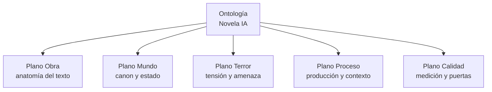
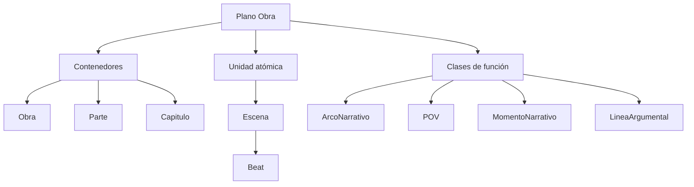
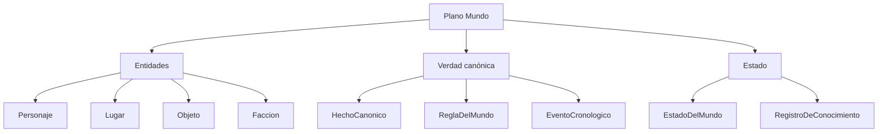
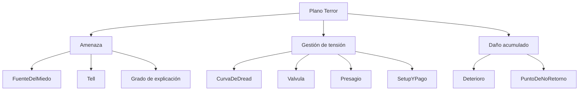
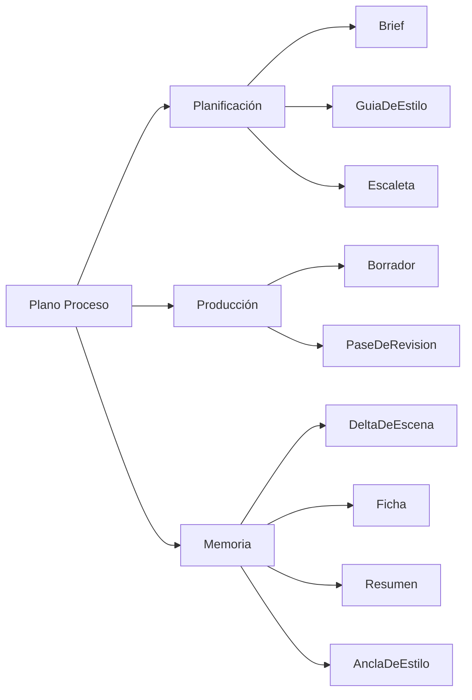
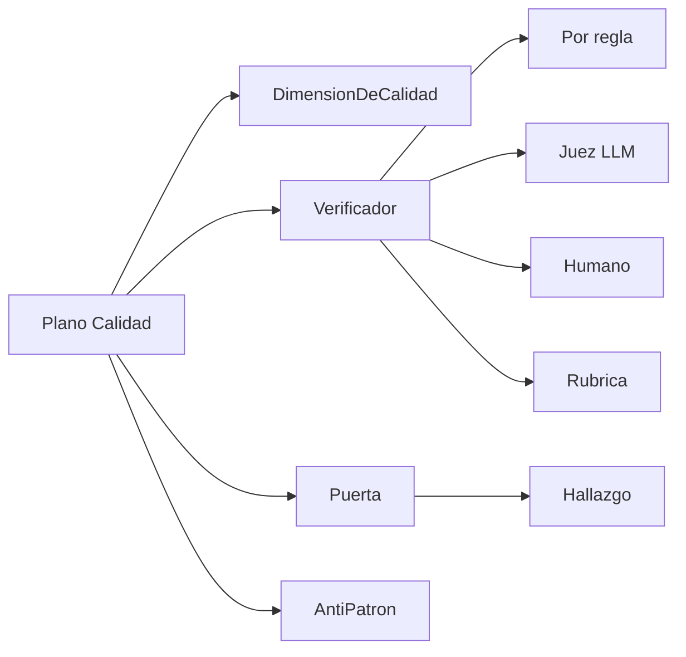
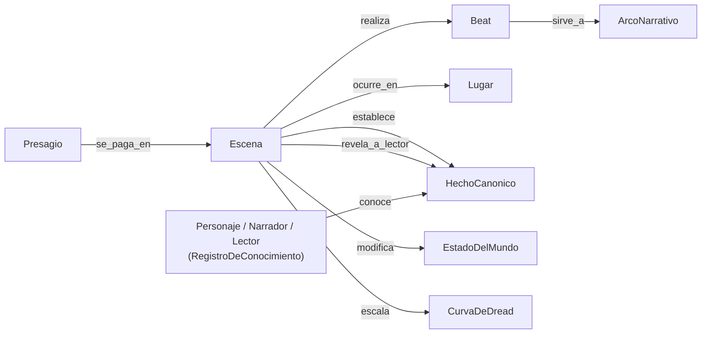
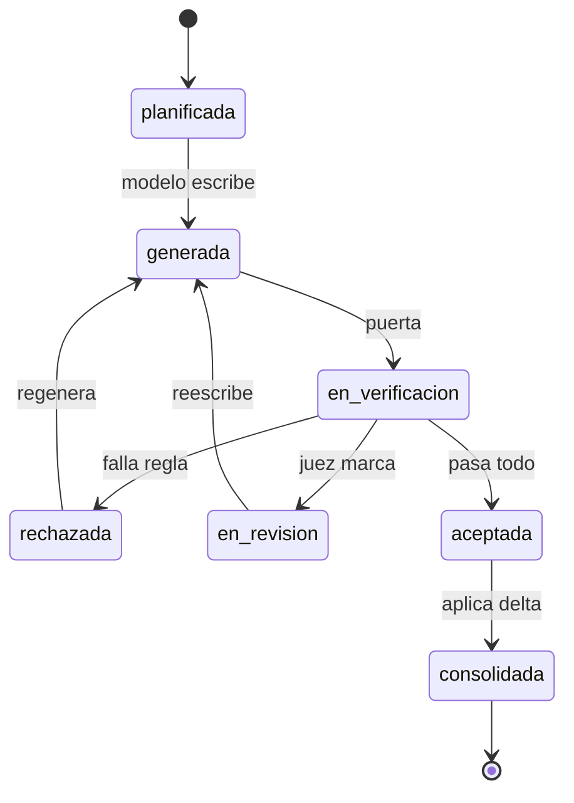
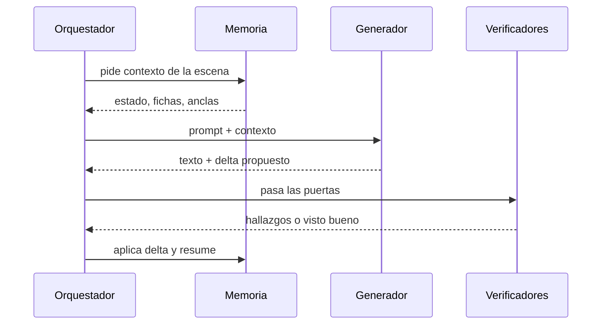

# Ontología de novelas IA — Árbol y diagramas

2026-09-21 · @Santiago Espinosa Domínguez

El árbol de la ontología en diagramas Mermaid, partido en vistas de menos de quince nodos para que cada una se lea de un golpe. Las definiciones de cada clase están en `Docs/definitions.md`, que es la fuente: estos diagramas son una vista suya y, ante cualquier discrepancia, manda la definición.

## Árbol raíz

Los cinco planos son independientes en su definición y se cruzan solo a través de las relaciones. Obra y Mundo son declarativos; Terror es una capa de control sobre ambos; Proceso y Calidad describen el sistema, no la ficción.

## Plano Obra

La Escena cuelga aparte a propósito: es la unidad que se genera, se verifica y se recupera, mientras que los contenedores solo la ordenan. Las clases de función no contienen texto, califican escenas.

## Plano Mundo

La rama de estado es la que cambia con cada escena; entidades y verdad canónica son relativamente estables. El `RegistroDeConocimiento` está aquí y no en el plano Obra porque es un hecho del mundo —quién sabe qué— aunque su sujeto pueda ser el lector.

## Plano Terror

Las tres ramas responden a preguntas distintas: qué amenaza, cómo se dosifica y qué se va perdiendo. Un sistema que solo modela la primera produce monstruos, no miedo.

## Proceso y Calidad

La rama de memoria es la que decide si el sistema escala: sin `DeltaDeEscena` hay que releer el texto para saber el estado, y eso se rompe hacia el capítulo diez.

## Relaciones núcleo

Un árbol de clases no dice nada por sí solo. Estas son las aristas que hacen trabajar a la ontología.

Fíjate en el par crítico: `establece` y `revela_a_lector` apuntan al mismo hecho pero desde escenas distintas, y `conoce` añade una tercera fecha por cada sujeto. La distancia entre esas tres es, literalmente, donde vive el suspense.

## Ciclo de vida de una escena

Los nombres de estado son los literales de la enumeración `estado_de_escena` de
`Docs/definitions.md`, no una versión bonita de ellos.

La transición que importa es `Aceptada → Consolidada`: hasta que el delta no se aplica, el estado del mundo no ha cambiado y la escena siguiente no puede generarse. Es ahí donde se corta la propagación del error.

## Generación de una escena

El generador devuelve dos cosas, no una: el texto y el diff estructurado de lo que ha cambiado en el mundo. Pedir el delta en la misma llamada es más barato y más fiel que extraerlo después releyendo la escena.
