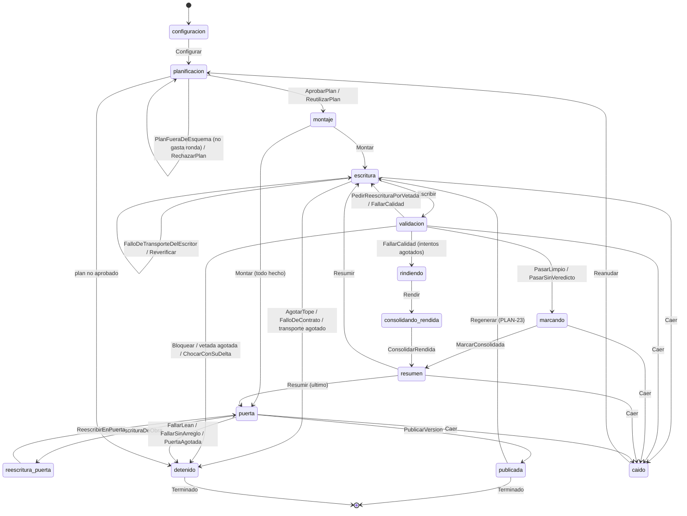
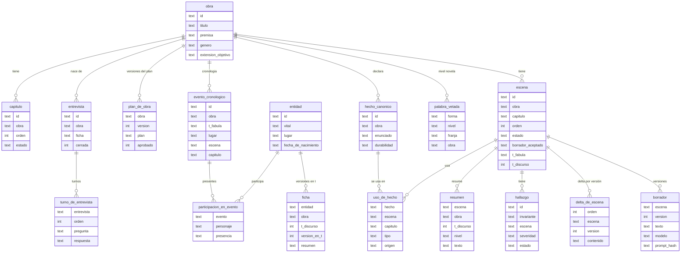

# Diagramas

Los cuatro que pide el enunciado. Los del modelo de dominio —árbol por planos, relaciones,
ciclo de vida de la escena— están en `docs/domain-knowledge.md` y no se repiten aquí.

## Arquitectura del harness

Un capítulo es una escena (`SPEC-26` `RF-01`). Cada caja con borde grueso es un agente
delegado en su propia sesión de Claude Code (`A-03`, `SPEC-14`).

Lo punteado está aprobado y sin construir: la puerta de publicación (`SPEC-30`) y las
versiones (`SPEC-23`, `EX-14`). Tampoco aparecen todavía las tools (`SPEC-28`) ni Langfuse
(`SPEC-29`).

## Máquina de estados de TLA+

Las acciones de `specs/tla/HarnessBackend.tla`, que modela **`backend/`** (`EX-07`). Cada
estado del diagrama es un valor de la variable `fase`; cada flecha, una acción, y cada acción
es lo que el código deja escrito en la base en una transacción. Qué función implementa cada
una está en `specs/tla/README.md` § "Qué implementa cada acción". El modelo anterior, el de la
rama `main` (`HarnessNovela.tla`), se conserva allí como historia.

`Caer` puede ocurrir en cualquier fase de trabajo; en el diagrama solo se dibujan las cinco
que producen contraejemplos. `marcando` y `consolidando_rendida` existen porque consolidar son
dos transacciones (`F-112`): con la corrección, las dos flechas se funden en una.

Lo que TLC comprueba sobre 5 capítulos y 2 reintentos (`specs/tla/HarnessBackend.cfg`):
`NuncaPublicaSinValidar`, `NuncaPierdeCapitulos`, `NoReescribeCerrados`, `NoSaltaCapitulos`,
`SoloSobreConsolidadas`, `MemoriaCompleta`, `ReintentosAcotados`, `RondasDePlanConservadas`,
`DelegacionesAcotadas`, `CadaVersionTieneSuTope` y `LectorVeLoPublicado` como invariantes, y
`VersionesSoloCrecen` y `Terminacion` como propiedades temporales. Con los valores del código
de hoy (`BackendDeHoy.cfg`) fallan nueve —siete por `backend/` y dos por el diseño de
`PLAN-23`—; los contraejemplos están en `specs/tla/README.md`.

## Esquema SQLite

Las tablas de la story bible y su contorno inmediato, con las columnas que se leen en los
`CREATE TABLE` del backend. Faltan las de infraestructura (`trabajo`, `procedencia`,
`esquema_version`, `vectores`).

Fuera del diagrama, junto a él: `traza_de_delegacion` (una fila por delegación, con los dos
campos de tokens), `lectura_de_contexto` (qué entró en cada contexto), `decision_de_politica`
(el audit log) y `edicion_manual`.

## Validadores y su punto de ejecución

**Construido no es ejercido.** La columna *Ejercido en real* dice si el validador ha corrido
alguna vez con datos de una ejecución real, y qué hizo. La comprobó contra las bases y el
registro de hooks la auditoría del 2026-09-24, y **se puso al día el 2026-09-25** con la pasada
«antes» de la evaluación (`harness/evals/resultados.md`, que genera `evaluar.py`) y las
medidas de `R0` a `R5`, `B4` e `INV-30` en real (`harness/evals/medidas.md`). Todos los que dicen *sin ejercer* existen y pasan sus pruebas con dobles, y **nunca
han visto un dato real**: un validador que no ha podido fallar no está verificado, solo
declarado.

| Validador | Tipo | Dónde se ejecuta | Si falla | Ejercido en real |
| --- | --- | --- | --- | --- |
| Schema de la ficha | Programático | Al cerrar la entrevista, y al arrancar `novela_regalo.py` | No se entrega la ficha | **En parte**: validó las dos fichas de las ejecuciones reales al arrancar. Al cerrar una entrevista, nunca: no hay ninguna entrevista real (`F-70`) |
| Contradicciones de la entrevista | Programático | Durante la entrevista | Se pregunta al comprador | **Sí**: en `R4` el Entrevistador real detectó las tres contradicciones del brief (edad frente a romance, a boda y a un recuerdo) |
| Schema de la salida de cada rol | Programático | Al recibir cada salida | La ronda o el intento se repite | **Sí**: rechazó 4 planes reales, dos por base. El contrato del Escritor pasó 3 veces. Editor y Resumidor, sin ejercer |
| Cobertura del plan (`SPEC-26` `RF-06`) | Programático | Antes del Revisor del plan | El plan vuelve al Planificador | **Sí, sin haber fallado nunca**: los dos planes que llegaron al Revisor la pasaron |
| Revisor del plan | Semántico | Tras la cobertura | Objeciones, hasta 3 revisiones | **Sí**: aprobó a la primera en `R1`, y en `R3` **rechazó el plan por las incoherencias temporales que el brief provoca**, en tres rondas |
| `validar_capitulo.py` | Programático, hook `Stop` | Al terminar el Escritor, dentro de su sesión | Se le devuelve en la misma sesión | **Sí, sin detectar nada**: en `R0` actuó sobre el Escritor con código 0 (antes, sus 4 ejecuciones reales fueron en la rama que no comprueba nada, `F-61`) |
| `policy.py` | Programático, hook `PreToolUse` | Antes de cada herramienta de un agente del pipeline | Se niega y va al audit log | **Sí, sin negar nada**: en `R0`, 3 veces sobre el Escritor y 4 sobre el Editor, código 0. Negar una herramienta real, sin ejercer |
| `INV-21` palabras vetadas | Programático, `bloqueante` | Tras el Escritor, antes del Editor | Reescritura, tope 2; agotado, se para | **Sí, tras el arreglo de `F-59`**: pasó en `R1` y en `R5` sin ninguna coincidencia. En `R5` no tuvo nada que detectar: el Escritor esquivó las variantes porque su prompt le da la lista |
| `INV-22` nombres exactos | Programático, `bloqueante` | Tras el Escritor, antes del Editor | Reescritura, tope 2; agotado, se para | **Sí**: pasó en `R1` y `R5` |
| `INV-23` palabras clave de los imprescindibles | Programático, `mayor` | Tras el Escritor | Reescritura dentro de los intentos de calidad | **Sí**: pasó en `R1` y `R5` |
| `INV-17` longitud | Programático, `mayor` | Puerta de escena | Hallazgo | **Sí**: dos disparos en `R1` (capítulos 3 y 5, que quedaron como hallazgo `mayor`) y dos en `R5` |
| `INV-03` conocimiento | Programático, `bloqueante` | Puerta de escena | La escena se para | **Sí**: paró `R5` en el capítulo 2 (*«Luisa actúa sobre `imp-01` y no consta que lo conozca»*); la reanudación pasó |
| `INV-26` nota del Editor por criterio | Semántico, `mayor` | Rol editor, tras las reglas | Reescritura, hasta 3 | **Sí**: las seis notas de cada capítulo en `R1` y `R5`; en `R5` disparó dos reescrituras. En `R0` salió sin veredicto (`F-76`, cerrado) |
| `INV-08` orden temporal | Programático, `mayor` | Puerta de capítulo | Hallazgo | **Sin veredicto incluso en las dos novelas publicadas** (`R1`, `R5`): la tabla de `evaluar.py` no tiene constancia de que llegara a juzgar. La causa está sin investigar |
| `INV-24` cada imprescindible en algún capítulo | Programático, `bloqueante` | Nivel obra | La novela no se da por terminada | **Sí**: pasó en `R1` y `R5` |
| `INV-25` prosa repetitiva | Programático, `menor` | Nivel obra | Hallazgo | **Sí, y falló**: 7 disparos en `R1` y 5 en `R5`, `menor`, sin bloquear. Lo que enseñaba al lector salía normalizado (`F-141`, cerrado) |
| `INV-27` juicio de obra del Editor | Semántico, `mayor` | Nivel obra, en la puerta | Bloquea la publicación (`SPEC-30` `RF-07`) | **Sí**: pasó en `R1` y `R5` |
| Lean `L-1`…`L-4` | Formal | Puerta de publicación | No se publica; vuelve al Editor, tope 2 | **Sí, en la puerta**: `0` en `R1` y en `R5`, que se publicaron. En `B4` no podía publicar una versión 2 o posterior (`F-151`, cerrado): la versión 3 se publicó en la ronda 2 |
| `INV-30` validación visual con browser MCP (`SPEC-22` `RF-58`) | Semántico, `mayor`: lo juzga el agente `inspector_visual` con Playwright MCP | Puerta de publicación, **después** de publicar, como `INV-27`; hoy se lanza a mano con `backend/inspeccion_visual.py` sobre una base y la URL servida | Deja un hallazgo `INV-30` (`abierto`, o `sin_veredicto` si el veredicto no se lee) y sube `INV-30.<pieza>` como score en la sesión de la obra. ❌ **No vuelve al Escritor ni al rol correspondiente**: el hallazgo queda abierto y lo resuelve una persona. Es lo que `RF-58` deja fuera, y está sin hacer | **Sí, y falló**: sobre una copia de la base de `R1` falló en capítulos y fichas con dos defectos reales (`F-141`, cerrado; `F-142`, abierto), 0,6959 USD. Antes, sobre la semilla inventada, pasó las cinco piezas (0,4872 USD). Los scores no llegaron a Langfuse (sin claves en el worktree) |
| Revisión humana | Semántico | Una novela completa, fuera del pipeline | Compara con el Editor | **No existe** (`SPEC-31`) |

El envío de los scores a Langfuse está construido (`SPEC-29`, `PLAN-29` E6). A una instancia
real **sí llegaron las observaciones y el coste**: 15 observaciones en la sesión de `R0`, y el coste
de `R1` coincide con el libro de gasto. **Que los scores de los validadores llegaran está sin
comprobar en este documento.**
