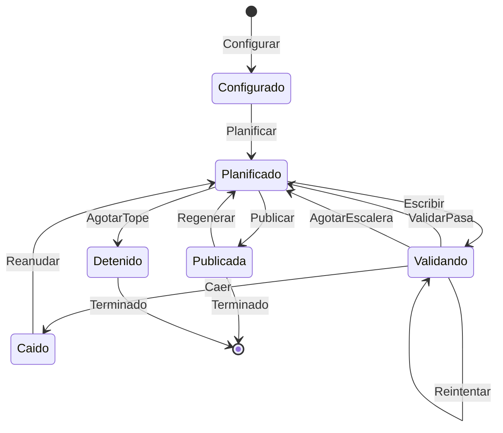

# Diagramas

Los cuatro que pide el enunciado. Los del modelo de dominio —árbol por planos, relaciones,
ciclo de vida de la escena— están en `docs/domain-knowledge.md` y no se repiten aquí.

## Arquitectura del harness

Un capítulo es una escena (`SPEC-26` `RF-01`). Cada caja con borde grueso es un agente
delegado en su propia sesión de Claude Code (`A-03`, `SPEC-14`).

Lo punteado está aprobado y sin construir: la puerta de publicación (`SPEC-30`) y las
versiones (`SPEC-23`, `EX-14`). Tampoco aparecen todavía las tools (`SPEC-28`) ni Langfuse
(`SPEC-29`).

## Máquina de estados de TLA+

Las acciones de `specs/tla/HarnessNovela.tla`. **Modela el flujo de la rama `main`, no el de
`backend/`**; rehacerlo contra `backend/` está decidido y pendiente (`EX-07`), y la escalera
de modelos de `Reintentar` y `AgotarEscalera` desaparece al hacerlo.

Los estados son una lectura para el diagrama; en la especificación el estado es el valor de
sus variables. Lo que TLC comprueba sobre 5 capítulos y 2 intentos: `NuncaPublicaSinValidar`,
`NuncaPierdeCapitulos`, `NoReescribeCerrados`, `NoSaltaCapitulos` y `ReintentosAcotados`
como invariantes, y `VersionesSoloCrecen` y `Terminacion` como propiedades temporales
(`specs/tla/HarnessNovela.cfg`).

## Esquema SQLite

Las tablas de la story bible y su contorno inmediato, con las columnas que se leen en los
`CREATE TABLE` del backend. Faltan las de infraestructura (`trabajo`, `procedencia`,
`esquema_version`, `vectores`).

Fuera del diagrama, junto a él: `traza_de_delegacion` (una fila por delegación, con los dos
campos de tokens), `lectura_de_contexto` (qué entró en cada contexto), `decision_de_politica`
(el audit log) y `edicion_manual`.

## Validadores y su punto de ejecución

**Construido no es ejercido.** La columna *Ejercido en real* dice si el validador ha corrido
alguna vez con datos de una ejecución real, y qué hizo; lo comprueba contra las bases
(`backend/regalo-prueba.db`, `backend/regalo-real.db`) y el registro de hooks la auditoría del
2026-09-24. Todos los que dicen *sin ejercer* existen y pasan sus pruebas con dobles, y **nunca
han visto un dato real**: un validador que no ha podido fallar no está verificado, solo
declarado.

| Validador | Tipo | Dónde se ejecuta | Si falla | Ejercido en real |
| --- | --- | --- | --- | --- |
| Schema de la ficha | Programático | Al cerrar la entrevista, y al arrancar `novela_regalo.py` | No se entrega la ficha | **En parte**: validó las dos fichas de las ejecuciones reales al arrancar. Al cerrar una entrevista, nunca: no hay ninguna entrevista real (`F-70`) |
| Contradicciones de la entrevista | Programático | Durante la entrevista | Se pregunta al comprador | **Sin ejercer** |
| Schema de la salida de cada rol | Programático | Al recibir cada salida | La ronda o el intento se repite | **Sí**: rechazó 4 planes reales, dos por base. El contrato del Escritor pasó 3 veces. Editor y Resumidor, sin ejercer |
| Cobertura del plan (`SPEC-26` `RF-06`) | Programático | Antes del Revisor del plan | El plan vuelve al Planificador | **Sí, sin haber fallado nunca**: los dos planes que llegaron al Revisor la pasaron |
| Revisor del plan | Semántico | Tras la cobertura | Objeciones, hasta 3 revisiones | **Sí**: aprobó un plan y devolvió otro con objeciones |
| `validar_capitulo.py` | Programático, hook `Stop` | Al terminar el Escritor, dentro de su sesión | Se le devuelve en la misma sesión | **Sin ejercer sobre un capítulo**: sus 4 ejecuciones reales fueron con el Planificador o el Revisor, en la rama que sale sin comprobar nada (`F-61`) |
| `policy.py` | Programático, hook `PreToolUse` | Antes de cada herramienta de un agente del pipeline | Se niega y va al audit log | **Sin ejercer**: ninguna ejecución registrada |
| `INV-21` palabras vetadas | Programático, `bloqueante` | Tras el Escritor, antes del Editor | Reescritura, tope 2; agotado, se para | **Sí, y solo en falso**: sus 46 coincidencias reales fueron «coño» normalizada en «con» (`F-59`). El arreglo está sin ejercer |
| `INV-22` nombres exactos | Programático, `bloqueante` | Tras el Escritor, antes del Editor | Reescritura, tope 2; agotado, se para | **Sí, con toda probabilidad en falso**: no deja rastro en el audit log (`F-73`), y con el código de hoy los tres borradores reales dan positivo por «Nada» y «Nadie» (`F-71`) |
| `INV-23` palabras clave de los imprescindibles | Programático, `mayor` | Tras el Escritor | Reescritura dentro de los intentos de calidad | **Sin ejercer**: los tres intentos reales se pararon antes |
| `INV-17` longitud | Programático, `mayor` | Puerta de escena | Hallazgo | **Sí**: un hallazgo real, 1.564 palabras |
| `INV-03` conocimiento | Programático, `bloqueante` | Puerta de escena | La escena se para | **Sí**: dos hallazgos en la primera ejecución real, por los imprescindibles (`F-60`, cerrado y sin ejercer desde el arreglo) |
| `INV-26` nota del Editor por criterio | Semántico, `mayor` | Rol editor, tras las reglas | Reescritura, hasta 3 | **Sin ejercer**: el Editor no se ha llamado nunca en la novela regalo |
| `INV-08` orden temporal | Programático, `mayor` | Puerta de capítulo | Hallazgo | **Sin ejercer**: ninguna escena consolidada |
| `INV-24` cada imprescindible en algún capítulo | Programático, `bloqueante` | Nivel obra | La novela no se da por terminada | **Sin ejercer** |
| `INV-25` prosa repetitiva | Programático, `menor` | Nivel obra | Hallazgo | **Sin ejercer** |
| `INV-27` juicio de obra del Editor | Semántico, `mayor` | Nivel obra, en la puerta | Bloquea la publicación (`SPEC-30` `RF-07`) | **Sin ejercer** |
| Lean `L-1`…`L-4` | Formal | Puerta de publicación | No se publica; vuelve al Editor, tope 2 | **Sin ejercer en una generación**: la puerta no se ha alcanzado nunca. Lean de verdad sí ha corrido desde el backend, sobre dos bases sembradas y sobre `regalo-prueba.db`, que dio `2` por cero eventos (`specs/lean/medidas.md`) |
| Validación visual con browser MCP | Programático | Sobre la lectura web | Vuelve al rol correspondiente | **No existe**: espera al frontend (`EX-04`) |
| Revisión humana | Semántico | Una novela completa, fuera del pipeline | Compara con el Editor | **No existe** (`SPEC-31`) |

El envío de los scores a Langfuse está construido (`SPEC-29`, `PLAN-29` E6) y **ningún score
ha llegado nunca a una instancia real**.
