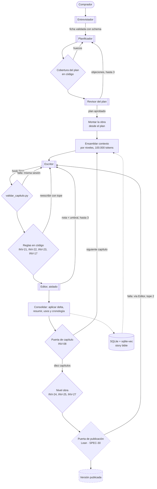
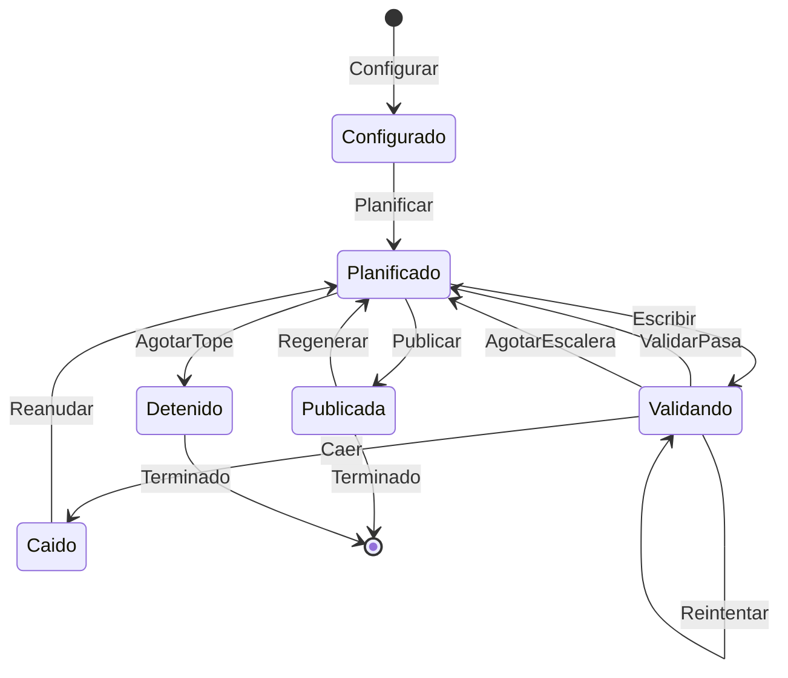

# Diagramas

Los cuatro que pide el enunciado. Los del modelo de dominio —árbol por planos, relaciones,
ciclo de vida de la escena— están en `docs/domain-knowledge.md` y no se repiten aquí.

## Arquitectura del harness

Un capítulo es una escena (`SPEC-26` `RF-01`). Cada caja con borde grueso es un agente
delegado en su propia sesión de Claude Code (`A-03`, `SPEC-14`).

Lo punteado está aprobado y sin construir: la puerta de publicación (`SPEC-30`) y las
versiones (`SPEC-23`, `EX-14`). Tampoco aparecen todavía las tools (`SPEC-28`) ni Langfuse
(`SPEC-29`).

## Máquina de estados de TLA+

Las acciones de `specs/tla/HarnessNovela.tla`. **Modela el flujo de la rama `main`, no el de
`backend/`**; rehacerlo contra `backend/` está decidido y pendiente (`EX-07`), y la escalera
de modelos de `Reintentar` y `AgotarEscalera` desaparece al hacerlo.

Los estados son una lectura para el diagrama; en la especificación el estado es el valor de
sus variables. Lo que TLC comprueba sobre 5 capítulos y 2 intentos: `NuncaPublicaSinValidar`,
`NuncaPierdeCapitulos`, `NoReescribeCerrados`, `NoSaltaCapitulos` y `ReintentosAcotados`
como invariantes, y `VersionesSoloCrecen` y `Terminacion` como propiedades temporales
(`specs/tla/HarnessNovela.cfg`).

## Esquema SQLite

Las tablas de la story bible y su contorno inmediato, con las columnas que se leen en los
`CREATE TABLE` del backend. Faltan las de infraestructura (`trabajo`, `procedencia`,
`esquema_version`, `vectores`).

Fuera del diagrama, junto a él: `traza_de_delegacion` (una fila por delegación, con los dos
campos de tokens), `lectura_de_contexto` (qué entró en cada contexto), `decision_de_politica`
(el audit log) y `edicion_manual`.

## Validadores y su punto de ejecución

| Validador | Tipo | Dónde se ejecuta | Si falla | Estado |
| --- | --- | --- | --- | --- |
| Schema de la ficha | Programático | Al cerrar la entrevista | No se entrega la ficha | Construido |
| Contradicciones de la entrevista | Programático | Durante la entrevista | Se pregunta al comprador | Construido |
| Cobertura del plan (`SPEC-26` `RF-06`) | Programático | Antes del Revisor del plan | El plan vuelve al Planificador | Construido |
| Revisor del plan | Semántico | Tras la cobertura | Objeciones, hasta 3 revisiones | Construido |
| `validar_capitulo.py` | Programático, hook `Stop` | Al terminar el Escritor, dentro de su sesión | Se le devuelve en la misma sesión | Construido; **no dejó constancia** en la ejecución real (`F-61`) |
| `policy.py` | Programático, hook `PreToolUse` | Antes de cada herramienta de un agente del pipeline | Se niega y va al audit log | Construido; allowlist por agente pendiente (`SPEC-28`) |
| `INV-21` palabras vetadas | Programático, `bloqueante` | Tras el Escritor, antes del Editor | Reescritura, tope 2; agotado, se para | Construido |
| `INV-22` nombres exactos | Programático, `bloqueante` | Tras el Escritor, antes del Editor | Reescritura, tope 2; agotado, se para | Construido |
| `INV-23` palabras clave de los imprescindibles | Programático, `mayor` | Tras el Escritor | Reescritura dentro de los intentos de calidad | Construido |
| `INV-17` longitud | Programático, `mayor` | Puerta de escena | Hallazgo | Construido |
| `INV-26` nota del Editor por criterio | Semántico, `mayor` | Rol editor, tras las reglas | Reescritura, hasta 3 | Construido |
| `INV-08` orden temporal | Programático, `mayor` | Puerta de capítulo | Hallazgo | Construido (`b2f097c`) |
| `INV-24` cada imprescindible en algún capítulo | Programático, `bloqueante` | Nivel obra | La novela no se da por terminada | Construido |
| `INV-25` prosa repetitiva | Programático, `menor` | Nivel obra | Hallazgo | Construido |
| `INV-27` juicio de obra del Editor | Semántico, `mayor` | Nivel obra | Bloquea la publicación (`SPEC-30` `RF-07`) | Construido el juicio; el bloqueo, pendiente |
| Lean `L-1`…`L-4` | Formal | Puerta de publicación | No se publica; vuelve al Editor, tope 2 | Funciona fuera del pipeline; **sin enchufar** (`SPEC-30`) |
| Validación visual con browser MCP | Programático | Tras publicar, sobre la lectura web | Vuelve al rol correspondiente | **No existe**: espera al frontend (`EX-04`) |
| Revisión humana | Semántico | Una novela completa, fuera del pipeline | Compara con el Editor | **Sin hacer** (`SPEC-31`) |

Ningún validador envía todavía su score a Langfuse (`SPEC-29` `RF-04`).
