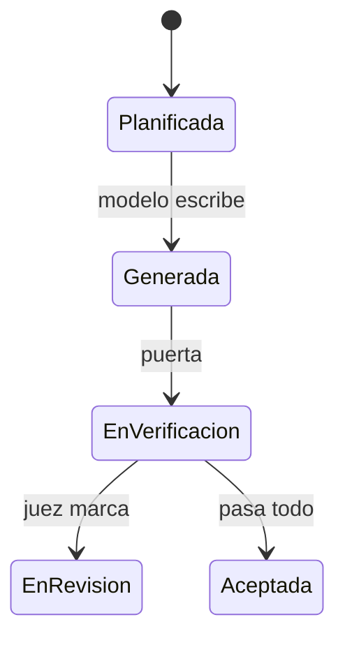

# Fixture roto a proposito

Reproduce los dos defectos reales de literales: los estados en PascalCase, que
es como estaba el diagrama de ciclo de vida, y un valor con tilde donde la tabla
lo tiene sin ella.

Y la fuente del miedo de esta obra es `pérdida_de_control`, escrita con tilde.
