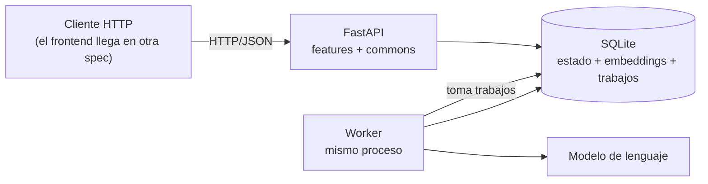
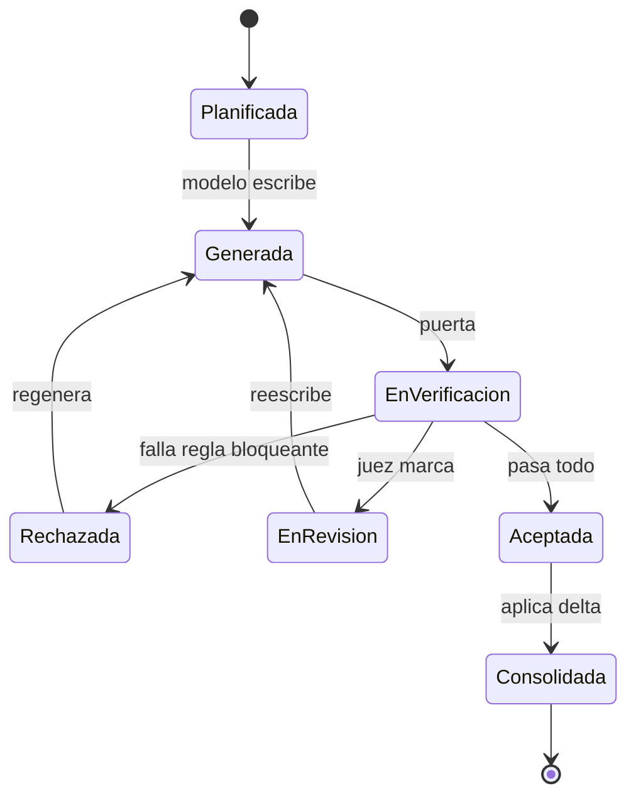
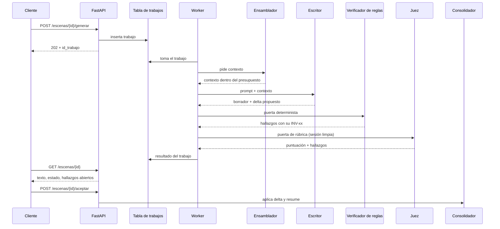

# SRS — Backend del harness de novelas

Especificación de requisitos del **backend**: el servicio que ejecuta el proceso de
generación y verificación de escenas descrito en `Docs/`.

## Qué es y qué no es este documento

**Es** la spec del backend, y solo del backend. Un documento, una spec: `SPEC-01`. El
frontend, la interfaz de puertas y cualquier otra pieza tendrán su propia spec, en su
propio fichero dentro de `specs/`.

**No es** una redefinición del dominio ni del proceso. El dominio está en
`Docs/definitions.md` y el proceso en `Docs/domain-knowledge.md` y `Docs/architecture.md`. Este
documento los toma como dados y especifica **qué tiene que hacer el backend para
ejecutarlos**.

**Precedencia.** Aquí se repiten cosas que ya están en `CLAUDE.md` y en `Docs/definitions.md`
para que el documento se pueda leer solo. Si alguna vez discrepan, **gana el original** y
este se corrige: `CLAUDE.md` en lo técnico, `Docs/definitions.md` en lo de dominio,
`Docs/architecture.md` en cómo se organiza el código.

| ID | Estado | Aprobada por | Fecha |
| --- | --- | --- | --- |
| `SPEC-01` | `en_revision` | — | — |

Sin `aprobada` no se escribe `specs/plans/PLAN-01.md` ni código.

---

# 1. Introducción

## 1.1 Propósito

Especificar la **primera versión del backend** del harness: el servicio FastAPI que
planifica, genera, verifica y consolida escenas de una novela, y que mide lo que produce.

Esta versión no busca una novela completa. Busca **llevar una escena de principio a fin
con todas las puertas cerrándose de verdad**, que es lo más pequeño que ejercita la
arquitectura entera: presupuesto de contexto, agentes, invariantes, delta y reconstrucción
de estado. Un sistema que hace eso una vez, lo hace cien veces; uno que no, no escala por
mucho que genere texto.

## 1.2 Alcance

**Entra** el recorrido vertical de una escena:

| Paso | Qué hace |
| --- | --- |
| `brief` | Dar de alta la obra: premisa, tono, guía de estilo, prohibiciones |
| `escaleta` | Planificar las escenas antes de escribirlas |
| `contexto` | Ensamblar el contexto de una escena dentro del presupuesto |
| `generacion` | Producir el borrador y el delta propuesto |
| `verificacion` | Pasar las puertas: reglas deterministas y juez |
| `consolidacion` | Aplicar el delta y resumir |
| `orquestacion` | Componer lo anterior y mover la máquina de estados |
| `commons` | Configuración, base de datos, enumeraciones, cliente del modelo, invariantes, trabajos |

**No entra**, y no por olvido:

| Fuera | Por qué |
| --- | --- |
| `revision/` (pases dirigidos) | Una escena puede recorrerse entera sin reescrituras dirigidas. Tiene consecuencias en §2.2.3 |
| `auditoria/` (invariantes de obra) | `INV-06`, `INV-09`, `INV-11`, `INV-12`, `INV-13` e `INV-16` necesitan la obra entera; con una escena no se pueden ejercitar |
| `lectura/` más allá de lo mínimo | Solo se exponen las consultas que el recorrido necesita |
| El frontend React | Esta versión se maneja por API. Es otra spec, en su propio fichero |
| Generar la novela completa | El objetivo es la escena, no el volumen |

## 1.3 Definiciones

Literales de `Docs/definitions.md`. No admiten sinónimos ni traducción.

| Término | Qué es |
| --- | --- |
| **Escena** | Unidad atómica: bloque continuo de tiempo y espacio con un cambio de valor. Es lo que se genera, se verifica y se recupera |
| **Cambio de valor** | Par `{eje, signo}` que toda escena mueve. Si no cambia nada, la escena sobra |
| **DeltaDeEscena** | Diff estructurado que la escena devuelve junto al texto: muertes, movimientos, revelaciones, setups pagados, cambios de posesión, deterioros |
| **EstadoDelMundo** | Instantánea del canon en `t`. No se redacta: se reconstruye acumulando deltas en orden |
| **RegistroDeConocimiento** | Quién sabe qué y desde cuándo. El sujeto puede ser personaje, narrador o lector |
| **Ficha** | Resumen recuperable de una entidad, para inyectar en contexto |
| **Hallazgo** | Defecto detectado, con su verificador, su escena y su severidad |
| **Puerta** | Condición que un artefacto debe pasar para avanzar |
| **Trabajo** | Unidad de trabajo asíncrono registrada en la base de datos |
| `INV-xx` | Invariante verificable de `Docs/definitions.md` |
| `VER-xx` | Fila del plan de verificación de `Docs/verification.md` |
| `A-xx` | Decisión de arquitectura de `Docs/architecture.md` |

## 1.4 Referencias

| Documento | Qué aporta |
| --- | --- |
| `CLAUDE.md` | Stack, límite de contexto y su reparto por niveles, reglas de Pydantic y enumeraciones, persistencia |
| `Docs/definitions.md` | Clases, atributos, vocabularios controlados e invariantes `INV-01`…`INV-16` |
| `Docs/domain-knowledge.md` | **El proceso**: ciclo de vida de la escena y secuencia de generación |
| `Docs/architecture.md` | Decisiones `A-01`…`A-09`, estructura por feature, agentes y quién dispara cada transición |
| `Docs/verification.md` | Modos de fallo `MF-01`…`MF-23` y validadores `VER-01`…`VER-55`, cada uno con su punto ciego |

---

# 2. Descripción general

## 2.1 Perspectiva del producto

Dos papeles en un solo proceso: **la API responde rápido y no llama nunca al modelo**; el
worker consume trabajos de la base y sí lo llama. Una sola base de datos, sin servicio de
vectores aparte ni cola externa.

## 2.2 El proceso que ejecuta el backend

Esta sección no inventa nada: recoge el proceso tal como está en `Docs/` y dice qué parte
cubre esta versión. Es el corazón del documento, porque todos los requisitos del §3
existen para que este proceso se ejecute bien.

### 2.2.1 Ciclo de vida de una escena

Los estados son la enumeración `estado_de_escena` de `Docs/definitions.md`:

Quién dispara cada transición, según `Docs/architecture.md`:

| Transición | Quién la dispara | Condición | ¿En la v1? |
| --- | --- | --- | --- |
| `planificada` → `generada` | Worker | El Escritor devuelve borrador y delta | Sí |
| `generada` → `en_verificacion` | Orquestador | Automática | Sí |
| `en_verificacion` → `rechazada` | Verificador de reglas | Falla una invariante `bloqueante` | Sí |
| `en_verificacion` → `en_revision` | Juez de rúbrica | Hallazgo `mayor` o `menor` | **No**, ver §2.2.3 |
| `en_verificacion` → `aceptada` | Orquestador | Pasa todas las puertas | Sí |
| `rechazada` → `generada` | Cliente de la API | Regeneración | Sí |
| `en_revision` → `generada` | Revisor | Reescritura dirigida | **No**, con `revision/` |
| `aceptada` → `consolidada` | Consolidador | Delta aplicado sin conflicto | Sí |

**La transición que importa es `aceptada` → `consolidada`.** Hasta que el delta no está
aplicado, el estado del mundo no ha cambiado y la escena siguiente no puede generarse. Es
donde se corta la propagación del error, y es también la frontera entre memoria a corto y
largo plazo (`M-2`).

### 2.2.2 Secuencia de una escena

Dos cosas que el proceso fija y que el §3 convierte en requisitos: **el Escritor devuelve
texto y delta en la misma llamada** —pedir el delta después, releyendo la escena, es más
caro y menos fiel—, y **la aceptación la dispara un cliente, no el worker**: la puerta la
cierra alguien.

### 2.2.3 Qué parte del ciclo cubre la v1, y una inconsistencia que hay que resolver

Como `revision/` queda fuera del alcance, el camino
`en_verificacion` → `en_revision` → `generada` **no existe en esta versión**. Eso obliga a
decidir qué pasa cuando el Juez levanta un hallazgo `mayor` o `menor`, y ahí los
documentos no dicen lo mismo:

| Documento | Qué dice |
| --- | --- |
| `CLAUDE.md` § Reglas de trabajo | *"`mayor` y `menor` generan hallazgo y dejan seguir"* |
| `Docs/architecture.md` § transiciones | `en_verificacion` → `en_revision` disparada por un hallazgo `mayor` o `menor` |

No pueden ser las dos: si va a `en_revision`, no sigue.

**Suposición de la v1, a confirmar al aprobar esta spec:** se sigue `CLAUDE.md`, que manda
en lo técnico. Un hallazgo `mayor` o `menor` **no** bloquea: la escena puede alcanzar
`aceptada` con el hallazgo abierto y visible. `en_revision` entra cuando entre `revision/`,
y entonces será una decisión del cliente mandar allí una escena, no un automatismo del
Juez. Queda anotado en §5.3 para cerrarlo en `Docs/architecture.md`.

## 2.3 Funciones principales

1. Dar de alta una obra a partir de un brief.
2. Planificar una escaleta de escenas.
3. Ensamblar el contexto de una escena sin pasarse del presupuesto.
4. Generar el texto de la escena y su delta en la misma llamada.
5. Verificar la escena contra las invariantes aplicables y producir hallazgos.
6. Aceptar o rechazar la escena, y al aceptarla aplicar el delta y resumir.
7. Informar del estado de todo lo anterior, incluidos los trabajos en curso.

## 2.4 Restricciones

De `CLAUDE.md`, no negociables desde aquí:

| Restricción | Detalle |
| --- | --- |
| Backend | FastAPI. Único servicio HTTP. Nada de lógica de dominio fuera de él |
| Persistencia | SQLite con extensión vectorial. Una sola base. Sin servicio de vectores externo |
| Contexto | 100.000 tokens, salida incluida. Ver `RNF-P` |
| Asincronía | Las llamadas al modelo son asíncronas: el endpoint arranca un trabajo y devuelve su identificador |
| Validación | Los modelos Pydantic son la frontera y replican las clases de `Docs/definitions.md`. Un campo que no está allí no entra en un esquema |
| Vocabularios | Los valores cerrados son `Enum`. Un valor fuera de la enumeración es un error de validación, no un aviso |

Reparto del presupuesto por nivel, tal como está hoy en `CLAUDE.md`:

| Nivel | Presupuesto | Contenido |
| --- | --- | --- |
| Inmutable | 15.000 | Premisa, guía de estilo, reglas del mundo, anclas de estilo |
| Estado actual | 10.000 | Instantánea del mundo en el momento de la escena |
| Local | 25.000 | Escena anterior completa y resumen de las tres previas |
| Recuperado | 20.000 | Fichas de entidades presentes, setups pendientes, registro de conocimiento aplicable |
| Resúmenes | 10.000 | Condensaciones de capítulo y de parte |
| Salida | 20.000 | Reserva para el texto generado y su delta |

**Suma exactamente 100.000.** Esa igualdad tiene consecuencias en `P-5`.
### Orden de recorte

`CLAUDE.md` dice que se recorta *"por el nivel de menor prioridad"* y no dice cuál es.
Este es el orden, y **también modifica `CLAUDE.md`**, igual que `P-1`.

**El orden opera sobre bloques, no sobre niveles**, y la diferencia no es de vocabulario:
el nivel `Recuperado` de `CLAUDE.md` se parte en dos bloques que caen a distinto lado de la
frontera de `RF-26`. La columna "Nivel del que sale" está ahí para trazar el origen, no
para recorrerla: quien implemente el recortador itera sobre las filas de esta tabla, nunca
sobre los seis niveles del presupuesto.

#### Recortar es elegir cuánto se conserva, no qué se pierde

**El recorte tiene dos vueltas.** Primero **reduce** todo lo reducible, en orden; solo
después **elimina** bloques enteros, también en orden. Entre "completo" y "ausente" hay
"reducido", y un bloque reducido sigue aportando.

Cada fila declara su forma reducida. **Un bloque sin forma reducida lo dice**, y ese dato
vale por sí solo: un bloque irreducible solo se puede perder entero, y saber cuáles son
cambia el orden.

| Orden | Bloque | Nivel del que sale | Forma reducida | Qué se pierde |
| --- | --- | --- | --- | --- |
| 1.º | Condensaciones de capítulo y de parte | Resúmenes | Solo las de capítulo; se van las de parte | Son condensaciones de condensaciones. Degradan el contexto lejano, que es el que menos afecta a la escena en curso |
| 2.º | Fichas de entidad y setups pendientes | Recuperado | **El grafo de accesos entre lugares** (`Lugar.accesos_y_salidas`) y nada más | Duele, pero es recuperable después. El grafo se queda porque `INV-02` lo lee |
| 3.º | Escena anterior completa y resumen de las tres previas | Local | **La escena anterior baja a su `Resumen`** | Aquí ya se nota: el texto pierde continuidad de tono y de ritmo |
| 4.º | Estado del mundo en `t` **y registro de conocimiento aplicable** | Estado actual + Recuperado | **El registro de conocimiento entero**, `entidades_vivas`, `ubicaciones` y solo los hechos `permanente` | Sin el estado el modelo inventa dónde está la gente. Sin el registro, `INV-03` no es peor: es **imposible** |
| 5.º | Problemas del intento anterior | Local | Solo los de severidad `bloqueante` y `mayor` | La reescritura repite el error que la motivó |
| 6.º | Reserva de salida | Salida | **Irreducible** | Recortar aquí no es recortar contexto: es **truncar la escena** |
| 7.º | Premisa, guía de estilo, reglas del mundo, anclas | Inmutable | **Irreducible** | **Nunca.** Sin esto no estás generando esta novela, estás generando otra |

**Por qué el registro de conocimiento sube a la cuarta posición y no se queda con el resto
de `Recuperado`.** `INV-03` es `bloqueante` y **depende de ese dato**. Si se recorta en
segunda posición, el recorte se lo lleva antes de que la regla de fallar llegue a
activarse, y la puerta queda en pie pero sin la información con la que juzgar: sigue ahí, y
ya no puede decidir.

**Por qué los problemas del intento anterior son de los últimos.** Si se van, la
reescritura repite el error que la motivó. Es el arreglo de un fallo real de la rama
`main`: allí el aviso de longitud lo leía la sesión orquestadora y no el escritor, así que
en el intento siguiente el escritor no sabía nada de él. Está contado junto a la Regla 2 de
`Docs/verification.md`.

#### Ninguna forma reducida se lleva lo que lee una `bloqueante` de escena

> **La forma reducida de un bloque nunca puede llevarse lo que lee una invariante
> `bloqueante` de nivel escena.** Si lo hace, la puerta sigue en pie y ya no puede decidir.

Es comprobable porque la tabla de invariantes de `Docs/definitions.md` declara, por fila,
**qué lee** cada una. Lo cruza `VER-59`.

**Ata a dos invariantes, no a cinco.** De las cinco `bloqueante` de nivel escena, solo
`INV-02` e `INV-03` leen bloques del contexto: `INV-01` mira un campo de la propia escena,
`INV-04` compara la escena con su borrador e `INV-05` mira el delta después de generar.
**Se escribe medido para que nadie relaje la regla por miedo a un coste que no existe**: una
regla que parece cara y no se ha medido se ablanda sola.

#### El patrón de las particiones

**Los bloques del contexto se definen por procedencia; las invariantes leen por necesidad.
Las dos particiones no coinciden**, y cada vez que se cruzan hay que partir algo. Van tres:

| Qué se partió | Quién lo obligó |
| --- | --- |
| `Recuperado`: el registro de conocimiento, de las fichas y los setups | `INV-03` |
| `Estado actual`: los hechos `permanente`, de los `efimero` | El recorte, con `INV-02` detrás |
| **`Lugar`**: el grafo de accesos, del resto de la ficha | `INV-02` |

La tercera enseña lo que las dos primeras no: **la partición no se detiene en el borde de un
bloque**. Puede entrar dentro de una clase y cortarla, porque lo que decide no es de dónde
viene el dato sino quién lo lee. Dos usos distintos del mismo objeto —la atmósfera de un
lugar es material para el escritor; sus accesos son material para la puerta— y el recorte
tiene derecho a distinguirlos.

**Quien defina el bloque siguiente no debería preguntarse *"¿qué cosas vienen de aquí?"*
sino *"¿qué de lo que hay aquí lo lee una puerta?"*.**

#### Tres números, no uno

| Número | Quién lo calcula | Para qué | Cuándo |
| --- | --- | --- | --- |
| `tokens_para_recortar` | El ensamblador | Decidir si hace falta otra vuelta | En cada iteración |
| `tokens_reservados` | El control de presupuesto | Apartar el techo por `P-2` | Una vez, antes de salir |
| `tokens_estimados` | El contador propio | Reconciliar contra el `usage` del proveedor | Una vez, al registrar la traza |

El primero es **una estimación conservadora con su margen declarado**, no una cuenta exacta:
lo que decide es *"me paso o no"*, no *"por cuánto"*, y contar exacto en cada vuelta del
bucle paga el tokenizador sin ganar nada. Los otros dos son exactos.

**Mezclar dos cualesquiera rompe la Regla 3 de `Docs/verification.md`.** Si el ensamblador y
la reserva comparten número, la reserva hereda el margen de una estimación barata. Si la
reserva y la traza lo comparten, `VER-41` compara un número consigo mismo y vuelve a ser el
eco que `SPEC-08` cerró. **Es justo lo que alguien unifica al refactorizar creyendo que
simplifica.**

#### El orden se cambia por spec, nunca por configuración

Un orden configurable es **un orden sin dueño**: si alguien lo cambia para desatascar una
generación, no queda rastro de por qué era el otro. Y `VER-06` pasaría a comprobar *"se
respetó lo que dijera el fichero"*, que es un criterio incapaz de marcar nada — `MF-24` otra
vez. Que el orden **se pueda cambiar** no está en discusión; lo que se fija es por dónde.

#### La reserva de este orden

**Este orden se eligió razonando, no midiendo**, igual que la primera versión de §2.4. Lo
que dirá si es el bueno es **la tendencia de los recortes**: si en la escena 40 aparecen
recortes que no había en la 3, la compactación no está funcionando y el orden es lo de
menos. Ese registro no existe todavía: `SPEC-11` lo diseñó —la traza
guarda los recortes, distinguiendo reducciones de eliminaciones— pero diseñarlo no es
tenerlo. **Caduca con:** `backend/app/features/orquestacion/`. Apuntó antes a
`features/contexto/` y volvió a disparar pronto: el ensamblador existe desde `PLAN-01` C1 y
el registro de recortes también, pero **el instrumento no es el dato**. Es el mismo techo de
la convención que se encontró en B2, y está como decisión abierta en `Docs/verification.md`.

## 2.5 Suposiciones y dependencias

- Una sola obra y un solo usuario. Sin multi-tenencia ni autenticación.
- Un único worker, en el mismo proceso que la API.
- El modelo de lenguaje es un servicio externo que puede fallar y tardar.
- La extensión vectorial de SQLite está disponible en el entorno de despliegue.
- **No hay ninguna medición previa** de tokens, coste ni latencia de este sistema. Todo
  requisito que necesitaría un número lo declara pendiente en vez de inventarlo.

---

# 3. Requisitos

## 3.1 Requisitos funcionales

### Alta de obra y escaleta

| ID | Requisito | Verifica |
| --- | --- | --- |
| **RF-01** | Se puede crear una `Obra` a partir de un `Brief` con premisa, tono, guía de estilo y prohibiciones. Los campos obligatorios de `Docs/definitions.md` son obligatorios aquí | — |
| **RF-02** | Se genera una `Escaleta`: lista ordenada de escenas planificadas, cada una con su `cambio_de_valor` previsto, su `pov`, su `lugar`, su `objetivo_dramatico` **y los `Beat` que realiza, cada uno ligado al `ArcoNarrativo` al que sirve** | `INV-01`, `INV-07` |
| **RF-03** | Toda escena de la escaleta nace en estado `planificada` | — |
| **RF-04** | La generación de la escaleta es asíncrona: devuelve un identificador de trabajo | — |

### Ensamblado de contexto

| ID | Requisito | Verifica |
| --- | --- | --- |
| **RF-05** | Antes de cada llamada al modelo se ensambla el contexto por niveles y **se comprueba que cabe en el presupuesto** | `VER-05` |
| **RF-06** | Si no cabe, se recorta siguiendo el **orden de recorte de §2.4**, en dos vueltas: primero se reduce todo lo reducible, y solo después se eliminan bloques enteros. Nunca truncando por el final ni partiendo un bloque | `VER-06` |
| **RF-07** | El contexto nunca incluye el texto completo de la obra. Solo la escena anterior entra en texto completo | `VER-07` |
| **RF-08** | Cada agente recibe únicamente los niveles que le corresponden según `Docs/architecture.md` | — |
| **RF-26** | **Si tras agotar todas las formas reducidas de §2.4 y eliminar los tres primeros bloques el contexto sigue sin caber, el trabajo falla en vez de generar.** El límite llega más tarde que antes a propósito: con degradación se llega más lejos perdiendo menos. El límite son **bloques, no niveles de `CLAUDE.md`**: el nivel `Recuperado` se parte en dos y sus dos mitades están a distinto lado de la frontera —fichas y setups en el bloque 2, que sí se recorta; registro de conocimiento en el bloque 4, que no—. Un recortador que itere por niveles se lleva el registro de conocimiento y deja `INV-03` sin datos. No se tocan los bloques 4.º, 5.º, 6.º ni 7.º | `VER-06`, `VER-59` |

### Generación

| ID | Requisito | Verifica |
| --- | --- | --- |
| **RF-09** | El Escritor devuelve **texto y `DeltaDeEscena` en la misma respuesta**. Una respuesta sin delta, o con delta fuera de esquema, se rechaza antes de llegar a las puertas | `VER-20` |
| **RF-10** | La escena pasa a `generada` cuando el Escritor devuelve borrador y delta válidos | — |
| **RF-11** | Cada `Borrador` conserva su versión, el modelo usado y el `prompt_hash`, para poder reproducir de dónde salió | — |

### Verificación

| ID | Requisito | Verifica |
| --- | --- | --- |
| **RF-12** | Las comprobaciones deterministas las ejecuta **código**, no un juez. El reparto entre regla y juez es el de la columna `Tipo` de `Docs/definitions.md` y no se reinterpreta caso por caso | — |
| **RF-13** | Se ejecutan las invariantes de nivel escena: `INV-01`, `INV-02`, `INV-03`, `INV-04`, `INV-05`, `INV-07`, `INV-10` | `VER-10`, `VER-11` |
| **RF-14** | Un fallo `bloqueante` detiene la escena en la puerta: no puede pasar a `aceptada`. `mayor` y `menor` generan `Hallazgo`, dejan seguir y el hallazgo queda abierto (ver §2.2.3) | `VER-11` |
| **RF-15** | Todo `Hallazgo` cita su invariante **por identificador** (`INV-07`), nunca por descripción | `VER-12` |
| **RF-16** | El Juez recibe el texto y la rúbrica, **no** el prompt ni el razonamiento del Escritor | `VER-25` |

### Aceptación y consolidación

| ID | Requisito | Verifica |
| --- | --- | --- |
| **RF-17** | La aceptación la dispara un cliente, **nunca el worker por su cuenta** | `VER-29` |
| **RF-18** | Al aceptar, el delta se aplica al estado del mundo y la escena pasa a `consolidada` | `INV-05`, `VER-10` |
| **RF-19** | **Ninguna escena posterior puede generarse mientras la anterior no esté `consolidada`** | `INV-05` |
| **RF-20** | Un delta incompatible con el estado en `t` no se aplica: produce hallazgo y la escena no se consolida | `INV-06` |
| **RF-21** | Al consolidar se produce el `Resumen` de la escena y se actualizan las `Ficha` de las entidades afectadas | — |
| **RF-22** | Al consolidar se indexan por similitud las fichas, el resumen y los presagios pendientes. **El texto completo se guarda pero no se indexa** | `VER-08` |

### Cierre de capítulo

El dominio lo fijó `SPEC-04`: `Capitulo.estado` con la enumeración `estado_de_capitulo`,
la condición de cierre y el disparador humano. Aquí solo se escribe como requisito.

Es la **segunda puerta con firma humana** del backend, junto con la aceptación de escena de
`RF-17`, y es la que da sentido a la primera. Al decidir que un hallazgo `mayor` no detiene
la escena, el control no desapareció: se movió aquí. Sin estos requisitos, un `mayor` no
tiene ninguna consecuencia en ninguna parte del sistema.

| ID | Requisito | Verifica |
| --- | --- | --- |
| **RF-27** | El cierre de capítulo lo dispara un cliente, **nunca el worker por su cuenta**, igual que la aceptación de escena | `VER-29` |
| **RF-28** | Un capítulo pasa a `cerrado` solo si **todas** sus escenas están `consolidada` y **ninguna tiene un hallazgo `mayor` con `estado = abierto`**. Un hallazgo `resuelto` o `descartado` no bloquea: `descartado` existe precisamente para cerrar un falso positivo sin fingir que se corrigió | `INV-05`, `VER-11` |
| **RF-29** | Los hallazgos `menor` abiertos **no bloquean el cierre, pero la respuesta los lista**. Quien firma tiene que ver qué deja pasar, o la diferencia entre `mayor` y `menor` vuelve a no existir | `VER-11` |
| **RF-30** | Un capítulo `cerrado` no se reabre. `estado_de_capitulo` tiene dos valores y una sola transición; no hay camino de vuelta | `VER-29` |

### Estado y trabajos

| ID | Requisito | Verifica |
| --- | --- | --- |
| **RF-23** | Consultar una escena devuelve siempre texto, **estado** y **hallazgos abiertos** juntos. Nunca el texto solo | `VER-18` |
| **RF-24** | Todo trabajo es consultable por su identificador, con su estado, sus intentos consumidos y el motivo del último fallo | `VER-04` |
| **RF-25** | Un dato que no se ha medido se devuelve como ausente y distinguible de cero | `VER-19` |

## 3.2 Interfaces externas

### 3.2.1 API HTTP

Contratos, no implementación. Los nombres de campo replican `Docs/definitions.md`.

| Método | Ruta | Entrada | Salida | Códigos |
| --- | --- | --- | --- | --- |
| `POST` | `/obras` | `Brief` | `Obra` con su `id` | 201, 422 |
| `GET` | `/obras/{id}` | — | `Obra` con partes, capítulos con su `estado_de_capitulo` y escenas con su `estado_de_escena` | 200, 404 |
| `POST` | `/obras/{id}/escaleta` | parámetros de planificación | `{id_trabajo}` | 202, 404, 409 |
| `GET` | `/escenas/{id}` | — | texto, `estado`, `cambio_de_valor`, delta propuesto, hallazgos abiertos | 200, 404 |
| `POST` | `/escenas/{id}/generar` | — | `{id_trabajo}` | 202, 404, 409 |
| `POST` | `/escenas/{id}/aceptar` | — | `Escena` consolidada | 200, 404, 409 |
| `POST` | `/escenas/{id}/rechazar` | motivo | `Escena` en `rechazada` | 200, 404, 409 |
| `POST` | `/capitulos/{id}/cerrar` | — | `Capitulo` en `cerrado`, **con la lista de hallazgos `menor` abiertos que se dejan pasar** (`RF-29`) | 200, 404, 409 |
| `GET` | `/trabajos/{id}` | — | estado, intentos, motivo del último fallo | 200, 404 |
| `GET` | `/trabajos` | filtro por estado | lista de trabajos | 200 |

Reglas transversales:

- **Ningún endpoint que llame al modelo responde de forma síncrona.** Devuelve `202` con
  un identificador de trabajo.
- **`409`** cuando la transición pedida no es legal en el estado actual. El cuerpo dice qué
  estado tiene y cuál se esperaba. En `/capitulos/{id}/cerrar` dice además **qué lo
  bloquea**: qué escenas no están `consolidada` y qué hallazgos `mayor` siguen abiertos.
  Sin eso, el cliente sabe que no puede cerrar y no sabe qué arreglar.
- **`422`** es la validación de Pydantic, incluidos los valores fuera de una enumeración.

### 3.2.2 Modelo de datos

Qué tablas existen y para qué. La DDL, los índices y las migraciones son del plan.

| Tabla | Contiene | Notas |
| --- | --- | --- |
| `obra`, `parte`, `capitulo` | Jerarquía estructural | `contiene` como clave foránea |
| `escena` | Los atributos obligatorios de `Escena`, con `POV` y `MomentoNarrativo` **embebidos como columnas** | Las dos son objetos de valor 1:1 (`narrada_desde` y `situada_en` son `1:1`), así que no necesitan tabla propia: 8 columnas |
| `beat`, `arco_narrativo` | Las dos entidades que `INV-07` necesita | Son `N:M` con `Escena` y entre sí, así que sí necesitan tabla |
| `escena_realiza_beat`, `beat_sirve_a_arco` | Las dos uniones | Materializan las relaciones `realiza` y `sirve_a` |
| `borrador` | Texto por versión, modelo y `prompt_hash` | Varios por escena |
| `delta_de_escena` | El diff estructurado por escena | Fuente de verdad del estado |
| `estado_del_mundo` | Instantánea materializada en `t` | Derivada: reconstruible desde los deltas |
| `personaje`, `lugar`, `objeto` | Entidades del canon | — |
| `hecho_canonico`, `registro_de_conocimiento` | Verdad y quién la sabe | `registro_de_conocimiento` sostiene `INV-03` |
| `presagio` | Setups plantados y su estado | Se indexa por similitud |
| `resumen`, `ficha`, `ancla_de_estilo` | Memoria a largo plazo | Se indexan por similitud |
| `hallazgo` | Defectos con su `INV-xx`, severidad y estado | — |
| `trabajo` | Cola y estado de los trabajos asíncronos | Soporte de `O-1` y `O-2` |
| Tablas `vec0` | Embeddings de fichas, resúmenes y presagios | **No** del texto de escena |

**El coste de `beat` y `arco_narrativo` no son dos tablas.** Alguien tiene que
**rellenarlas**, y ese alguien es el Escaletador: su salida pasa de una lista de escenas
con sus campos a una lista de escenas **con sus beats, y cada beat ligado al arco al que
sirve**. Eso hace su prompt más largo, su salida más grande y su validación más estricta,
y es trabajo que hoy no hace nadie. Reconocerlo aquí es parte de la decisión, no una nota
al pie.

Entran en la v1 no por completitud, sino por **el tipo de defecto que detectan**. `INV-07`
es lo único que distingue una escena necesaria de una de relleno, y ese fallo **no se ve
escena a escena**: se ve al leer la novela entera y notar que no avanza. Es el más caro de
descubrir tarde, porque cuando se nota ya hay treinta mil palabras escritas. Y sacarlo del
alcance tampoco habría cerrado el hueco: `pov` y `momento_narrativo` son atributos
obligatorios de `Escena` y seguirían sin tener dónde vivir.

### 3.2.3 Interfaz con el modelo de lenguaje

Cada agente es una llamada con contexto propio y salida tipada (`A-03`).

| Agente | Recibe | Devuelve | Validación |
| --- | --- | --- | --- |
| Escaletador | Brief, guía de estilo, estado, recuperado, resúmenes | `Escaleta`, **con sus `Beat` y los `ArcoNarrativo` a los que sirven** | Esquema Pydantic; rechazo si falla |
| Escritor | Los niveles que le tocan | Texto **y** `DeltaDeEscena` | Rechazo si falta el delta |
| Juez | Texto y `Rubrica`, sin el prompt del Escritor | Puntuación y `Hallazgo[]` | Rechazo si falla |
| Resumidor | La escena consolidada | `Resumen` y `Ficha` actualizadas | Rechazo si falla |

## 3.3 Requisitos no funcionales

Los identificadores `O-`, `M-`, `P-` y `T-` se conservan de la versión 1. No se renumeran.

### Orquestación (`RNF-O`)

- **O-1.** Cada transición de la máquina de estados es un trabajo registrado en la tabla
  de trabajos. El Orquestador **no guarda estado en memoria del proceso**.
- **O-2.** Un reinicio del servidor no pierde el progreso **registrado**: las transiciones
  ya escritas en la tabla siguen ahí, que es para lo que `A-05` eligió una tabla frente a
  `BackgroundTasks`. Lo que **no** ocurre es el relanzamiento automático: el trabajo que
  estaba en vuelo no se retoma solo, porque pudo haber llamado al modelo antes de morir y
  relanzarlo a ciegas paga dos veces. Lo relanza una persona, viendo qué pasó
  (`Docs/architecture.md` § "El trabajo que nadie terminó").
- **O-3.** Los fallos **transitorios** (red, timeout) se reintentan con espera creciente y
  un tope acotado de intentos. Los fallos **de contrato** (salida fuera de esquema) **no**
  se reintentan: el trabajo queda marcado como fallido y visible. Reintentar a ciegas un
  fallo de contrato suele limitarse a repetirlo y a gastar llamadas.
- **O-4.** Los intentos consumidos y el motivo del último fallo son visibles por trabajo.

### Memoria a corto y largo plazo (`RNF-M`)

- **M-1.** La frontera entre corto y largo plazo es **la consolidación**. Corto plazo: la
  escena en curso y la anterior, en texto completo. Largo plazo: lo ya consolidado —deltas
  aplicados, resúmenes, fichas y embeddings—.
- **M-2.** El `DeltaDeEscena` es lo único que cruza de corto a largo plazo, y cruza en la
  transición `aceptada` → `consolidada`. Es la misma transición que `INV-05` protege, así
  que la frontera de memoria y la puerta que corta la propagación del error son el mismo
  punto.
- **M-3.** Ningún texto de escena pasa a largo plazo. Al consolidarse, una escena deja en
  largo plazo su delta, su resumen y sus embeddings; su texto se conserva en la base pero
  no vuelve a entrar en el contexto.
- **M-4.** El largo plazo se consulta siempre por recuperación —similitud o clave—, nunca
  entero.

### Presupuesto concurrente (`RNF-P`)

- **P-1.** Los 100.000 tokens son un techo para **todo lo que está en vuelo a la vez**, no
  solo por llamada. **Esto modifica `CLAUDE.md`**, y esa modificación forma parte de esta
  spec.
- **P-2.** Una llamada reserva su presupuesto antes de salir y lo libera al volver, también
  cuando falla. Un fallo no puede dejar presupuesto retenido.
- **P-3.** Si no hay techo disponible, el trabajo **espera en cola**. No se recorta el
  contexto para que quepa: degradar la calidad en silencio para ganar velocidad es
  exactamente el fallo que el sistema intenta evitar.
- **P-4.** "Esperando presupuesto" es un estado visible y distinguible de "en curso".
- **P-5.** Se asume y se deja escrito el efecto secundario: como el reparto por niveles
  suma exactamente 100.000, una llamada del Escritor a tamaño completo agota el techo
  global y es, de hecho, **exclusiva**. Los agentes que reciben menos niveles —Juez,
  Resumidor— sí pueden coincidir entre ellos.

**Qué aporta `P-1` si la ruta principal queda en concurrencia 1.** Que el límite exista y
se registre: impide que los agentes pequeños se acumulen sin control, impide que un
segundo worker futuro duplique el consumo sin darse cuenta, y convierte el consumo en
vuelo en un dato medible en vez de una suposición.

### Observabilidad (`RNF-T`)

- **T-1.** Cada llamada a un agente deja traza consultable con el agente, la escena, los
  niveles de contexto enviados y los tokens realmente consumidos.
- **T-2.** Una llamada que falla también deja traza.

## 3.4 Restricciones de diseño

De `Docs/architecture.md`. Condicionan el código, no solo su organización:

- **D-1.** Una carpeta por feature —caso de uso del pipeline— más `commons/` para lo
  compartido (`A-01`, `A-02`).
- **D-2.** Una feature **nunca** importa de otra feature. `commons/` **nunca** importa de
  una feature. `features/orquestacion/` es la única excepción, porque existe para componer.
- **D-3.** Los `Enum` de los vocabularios controlados **del dominio** viven **solo** en
  `commons/dominio/`. Los de infraestructura viven con su infraestructura: el de estados de
  un trabajo, en `commons/trabajos/`. Se escribió "los vocabularios controlados" cuando
  todos eran de dominio, y `SPEC-08` creó el primero que no lo es.
- **D-4.** La severidad de las invariantes se implementa una vez, en
  `commons/invariantes/`, y no se resuelve caso por caso en cada verificador.
- **D-5.** Las migraciones se versionan. Un cambio en `Docs/definitions.md` que altere un
  atributo obligatorio necesita su migración en el mismo commit.

---

# 4. Criterios de aceptación

El backend v1 está terminado cuando **todo** esto es cierto:

1. Se puede crear una obra desde un brief, generar su escaleta y llevar **una escena** de
   `planificada` a `consolidada` usando solo la API.
2. Una escena que viola `INV-01` (sin `cambio_de_valor`) **no** llega a `aceptada`.
3. Una escena que viola `INV-07` genera hallazgo, sigue adelante, y el hallazgo aparece al
   consultar la escena.
4. Matar el proceso con una generación a medias y volver a arrancarlo **retoma** el
   trabajo (`O-2`).
5. Una respuesta del Escritor sin delta se rechaza antes de las puertas (`RF-09`).
6. Intentar generar la escena siguiente con la anterior sin consolidar **falla** (`RF-19`).
7. Cada invariante ejecutada tiene su caso de prueba negativo, y ese caso falla si se
   desactiva la comprobación.
8. Las trazas muestran los tokens realmente consumidos por llamada.

## 4.1 Trazabilidad

| Requisito | Invariante | Fila de verificación |
| --- | --- | --- |
| RF-05, RF-06, RF-07, RF-26, P-1 | — | `VER-05`, `VER-06`, `VER-07` |
| RF-09 | — | `VER-20` |
| RF-13, RF-14, RF-15 | `INV-01`…`INV-04`, `INV-07`, `INV-10` | `VER-02`, `VER-11`, `VER-12` |
| RF-16 | — | `VER-25` |
| RF-18, RF-19, RF-20 | `INV-05`, `INV-06` | `VER-10` |
| RF-22 | — | `VER-08` |
| RF-23, RF-25 | — | `VER-18`, `VER-19` |
| RF-27, RF-28, RF-29, RF-30 | `INV-05` | `VER-11`, `VER-29` |
| O-2, O-3, O-4 | — | `VER-04`, y filas nuevas pendientes |
| M-2, M-3 | `INV-05` | filas nuevas pendientes |
| T-1, T-2 | — | `VER-24` |

`Docs/verification.md` necesita filas nuevas para `O-3`, `M-2`, `M-3`, `P-2` y `P-3`, y
`VER-05` hay que revisarla porque hoy habla del límite **por llamada**.

---

# 5. Fuera de alcance y pendientes

## 5.1 Explícitamente fuera

- El reparto numérico de tokens por agente. Sin medir (`VER-34`).
- El número de reintentos y la curva de espera de `O-3`.
- Subir el techo por encima de 100.000.
- Cambiar el reparto por niveles de `CLAUDE.md`.
- Paralelizar escenas entre sí: el estado se reconstruye acumulando deltas en orden.
- Autenticación, multiusuario y multi-obra.

## 5.2 Números que faltan

Ninguno lleva valor provisional. **Un umbral inventado que queda escrito deja de
distinguirse de uno medido.**

| Qué falta | Bloquea | Cómo se obtiene |
| --- | --- | --- |
| Umbrales de `INV-15` e `INV-16` | `VER-32`, `VER-33` | Medir sobre un corpus y fijar con esa medición. Es la decisión "Umbrales" abierta en `Docs/definitions.md`: se cierran a la vez o ninguna |
| Reparto de tokens por agente | `VER-34` | Instrumentar el consumo durante varias escenas |
| Coste por escena | `VER-36` | Medir una escena completa con `A-03` |
| Suficiencia del reparto por niveles | `VER-37` | Ensamblar el contexto de una escena real y ver si cabe |
| Tope de reintentos y espera de `O-3` | — | Observar la tasa real de fallos transitorios |

## 5.3 Decisiones abiertas que afectan a esta spec

**Cerradas el 2026-09-22**, y por eso ya no aparecen abajo:

- ~~La puerta de cierre de capítulo~~ — `SPEC-04` decidió el dominio y `RF-27`…`RF-30`
  con `/capitulos/{id}/cerrar` lo escriben aquí. Con esto **`D4-9` queda cerrado entero**.

- ~~El orden de recorte de los niveles de memoria~~ — fijado en §2.4, con la regla de
  fallar antes que generar por debajo del **bloque** 3 (`RF-26`).
- ~~Si `Beat` y `ArcoNarrativo` entran en la v1~~ — entran, con su coste reconocido en
  §3.2.2.

Siguen abiertas:

- **`mayor` y `menor`: ¿dejan seguir o van a `en_revision`?** `CLAUDE.md` y
  `Docs/architecture.md` se contradicen (§2.2.3). La v1 asume lo primero. Al cerrarlo hay
  que corregir el documento que quede en falso.
- **Desempate juez contra regla.** Con `INV-03` ya de tipo `regla` (`SPEC-04` C-6) y el
  Juez como desempate, falta decidir qué gana cuando la regla no ve nada y el Juez marca.
- **Persistencia del estado.** Si los deltas son la única fuente de verdad o se materializa
  `EstadoDelMundo` en cada `t`. El modelo de datos de §3.2.2 admite las dos; la decisión
  cambia qué se lee en caliente.
- **Granularidad de generación.** Escena completa o beat. Esta versión asume escena
  completa.

---

# 6. Historial

| Versión | Fecha | Cambio |
| --- | --- | --- |
| 1 | 2026-09-21 | Primera versión. Absorbe la spec de orquestación, memoria y presupuesto conservando los identificadores `O-`, `M-`, `P-` |
| 2 | 2026-09-21 | Pasa a ser **solo** la spec del backend: fuera el registro multi-spec. Se añade §2.2 con el proceso tomado de `Docs/`, y se documenta en §2.2.3 la contradicción entre `CLAUDE.md` y `Docs/architecture.md` sobre `mayor` y `menor` |
| 3 | 2026-09-22 | Se cierran dos bloqueantes. **§2.4 fija el orden de recorte** por qué se pierde si falta, y `RF-26` añade que por debajo del nivel 3 se falla en vez de generar. **`Beat` y `ArcoNarrativo` entran en la v1** con su coste reconocido: el Escaletador pasa a tener que rellenarlos. `D4-6` ya lo había cerrado `SPEC-03` al poner `cambios_de_estado_vital` en el delta |
| 5 | 2026-09-22 | **§2.4 reescrita por `SPEC-12`.** El recorte pasa a tener dos vueltas y cada bloque declara su forma reducida: recortar deja de ser elegir qué se pierde y pasa a ser elegir cuánto se conserva. Entra el bloque de problemas del intento anterior, se fija que ninguna forma reducida se lleva lo que lee una `bloqueante` de escena, se separan los tres números del presupuesto y se deja escrito que el orden se cambia por spec y nunca por configuración |
| 4 | 2026-09-22 | **Se cierra `D4-9` entero**: `RF-27`…`RF-30` y el endpoint `POST /capitulos/{id}/cerrar` escriben la puerta de cierre de capítulo que `SPEC-04` había decidido. `RF-26` y §2.4 dicen ya que el orden de recorte opera sobre **bloques**, no sobre niveles. No quedan bloqueantes |
