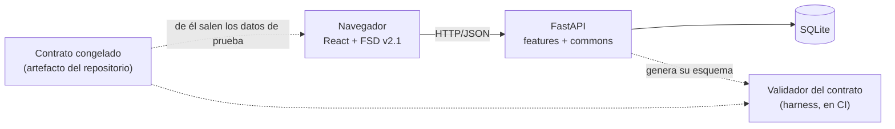

# SRS — Frontend de lectura y contrato congelado

Especificación de requisitos del **frontend** —la interfaz con la que se lee la obra y se
pide un cambio— y del **contrato** que lo separa del backend.

## Qué es y qué no es este documento

**Es** la spec del frontend y de la frontera. Un documento, una spec: `SPEC-22`. El backend
es `SPEC-01` y no se reescribe desde aquí.

**No es** una redefinición del dominio ni del proceso. El dominio está en
`docs/definitions.md`, la estructura del código en `docs/architecture.md` y el backend en
`SPEC-01`. Este documento los toma como dados y especifica **qué tiene que hacer la interfaz
y contra qué se valida**.

**Precedencia.** Aquí se repiten cosas que ya están en `CLAUDE.md`, en `docs/definitions.md`
y en `SPEC-01` para que el documento se pueda leer solo. Si alguna vez discrepan, **gana el
original** y este se corrige.

| ID | Estado | Aprobada por | Fecha |
| --- | --- | --- | --- |
| `SPEC-22` | `aprobada` | `@Santiago Espinosa Domínguez` | 2026-09-23 |

**La versión 2 no vuelve a pedir aprobación: es la misma spec reformateada.** Lo aprobado en
la versión 1 —las nueve decisiones `C-x`, las cuatro `D-x` y lo que queda fuera— sigue
diciendo lo mismo; lo que cambia es la forma, para poder implementarla. El cambio de forma
está en §8 y ahí es donde se lee qué se movió. Con la spec aprobada, lo que sigue es
`specs/plans/PLAN-22.md`, que se aprueba por su cuenta.

**Identificadores que reserva esta spec**, comprobados contra lo publicado el 2026-09-23:
`RF-31`…`RF-57`, `NF-01`…`NF-07`, `DF-1`…`DF-3`, `CA-1`…`CA-9`, `PCF-1`…`PCF-7` y
`DA-1`…`DA-6`. `RF-30` era el último publicado, y la serie `RF` es de hecho global: la define
`SPEC-01` y el resto del repositorio la cita sin prefijo de spec.

**Los `C-1`…`C-9` y los `D-1`…`D-4` de la versión 1 no se renumeran ni desaparecen.** La
versión 1 estaba escrita como spec de cambio y servía para decidir; esta la reescribe como
SRS para poder implementarla. Cada requisito de §3 dice de qué `C-x` sale, y las cuatro
decisiones `D-1`…`D-4` siguen en §7 con su texto. Nada de lo decidido se vuelve a abrir aquí.

---

# 1. Introducción

## 1.1 Propósito

Especificar la **primera versión del frontend**: la interfaz de lectura de una obra ya
generada, con la petición de cambio que dispara una regeneración selectiva. Y, antes que
ella, **el contrato congelado** que permite construirla sin que el backend se mueva por
debajo.

El orden no es casual y es una decisión (`D-4`): el contrato primero, las páginas después.

## 1.2 Alcance

**Entra:**

| Pieza | Qué es |
| --- | --- |
| Contrato congelado | El esquema OpenAPI del backend, versionado en el repositorio, con el significado de cada campo |
| Validador del contrato | La comparación entre el congelado y el que el backend genera hoy |
| Portada | Título y dedicatoria |
| Índice | Partes, capítulos en orden y escenas en orden, con sus estados |
| Lectura | El texto de un capítulo de corrido y el de una escena, siempre con estado y hallazgos |
| Fichas | `Personaje` y `Lugar`, con enlace a los capítulos donde aparecen |
| Petición de cambio | Selección de un fragmento y petición en palabras propias |
| Regeneración selectiva | Lo que la interfaz enseña antes, durante y después |

**No entra**, y no por olvido:

| Fuera | Por qué |
| --- | --- |
| Las vistas de operación —Puertas, Continuidad, Trabajos— | `docs/architecture.md` ya las enumera. Esta spec cubre la lectura de la obra y la petición de cambio |
| Autenticación y control de acceso | El proyecto no los tiene. `D-1` decide que no aparece un actor nuevo, que es otra cosa |
| Publicar la obra a un formato de libro | Portada y dedicatoria son de la interfaz de lectura, no de una exportación |
| La implementación del backend que falta | La lista de §5 es una dependencia, no el plan de trabajo de esta spec |
| Elegir tecnología dentro del frontend | React y FSD v2.1 ya están decididos (`CLAUDE.md`, `A-09`); lo demás es del plan |
| Crear o diseñar CI | `D-3` decide que el validador corre allí y deja dicho que allí no hay nada todavía |

## 1.3 Definiciones

Literales de `docs/definitions.md` y de `SPEC-01`. No admiten sinónimos ni traducción.

| Término | Qué es |
| --- | --- |
| **Contrato congelado** | El esquema OpenAPI del backend guardado como artefacto del repositorio. Lo que el frontend puede suponer del backend es lo que ahí está escrito, y nada más |
| **Hallazgo abierto** | `Hallazgo` con `estado = abierto`. Un `resuelto` o un `descartado` no lo es |
| **Ancla de una selección** | Un rango sobre un `Borrador` concreto **y su `version`**, no sobre "el texto" |
| **Versión de la obra** | Lo que `SPEC-23` `D-2` define: una obra con identidad propia que comparte por referencia los capítulos que no cambiaron |
| **Uso de un hecho** | El vocabulario `tipo_de_uso_de_hecho` de `SPEC-21` `C-2`: `establece`, `menciona`, `depende`, `contradice` |
| **Brief** | Lo que cambia con la novela: título, premisa, forma, estilo. `config/brief.json` |
| **Configuración del sistema** | Lo que cambia con la máquina: modelos, topes, presupuesto, ruta de la base. `config/sistema.json` |

## 1.4 Referencias

| Documento | Qué aporta |
| --- | --- |
| `CLAUDE.md` § React | *La interfaz muestra estado, no lo calcula*, y la regla de que una escena se muestra siempre con su estado y sus hallazgos |
| `docs/architecture.md` | `A-01`, `A-04`, `A-09`, su § "Frontend — React" y la frontera *el frontend nunca toca la base de datos y nunca calcula nada del dominio* |
| `docs/definitions.md` | `Obra`, `Parte`, `Capitulo`, `Escena`, `Borrador`, `DeltaDeEscena`, `Personaje`, `Lugar`, `HechoCanonico`, `PaseDeRevision`, las relaciones `contiene`, `participa_en`, `ocurre_en`, y las enumeraciones `estado_de_escena`, `estado_de_capitulo`, `estado_de_hallazgo`, `severidad` |
| `SPEC-01` | `RF-17`, `RF-19`, `RF-23`, `RF-24`, `RF-25`, `RF-27`…`RF-30`, y su §3.2.1, que es el contrato que esta spec sustituye por uno comprobable |
| `SPEC-21` | `C-1` (`escena.capitulo`) y `C-2` (qué significa usar un hecho) |
| `SPEC-23` | `D-1` (no hay verde heredado), `D-2` (dos versiones vivas), `D-3` (qué se le promete al lector) |
| `docs/verification.md` | `VER-09`, `VER-16`…`VER-19`, `VER-21`, `VER-60`, la **Regla 5**, la **Regla 9**, `MF-26` y `PC-1` |
| `REV-01` | `D3-5`: un requisito de backend no se cierra con una prueba de frontend |

---

# 2. Descripción general

## 2.1 Perspectiva del producto

Las flechas de puntos son lo que esta spec añade. **El frontend no habla con la base y no
arranca un backend para probarse**: se valida contra el congelado. Que el congelado siga
diciendo la verdad lo comprueba el validador, y ningún otro sitio.

## 2.2 El problema: una frontera que nadie comprueba

`frontend/` no existe. `A-09` eligió su estructura, `docs/architecture.md` § "Frontend —
React" enumeró sus vistas y `VER-16`…`VER-19` llevan desde entonces esperando a una carpeta
que nadie ha creado.

Pero el hueco que importa no es la carpeta que falta, sino **la frontera**. Hoy el contrato
entre las dos piezas vive en una tabla de markdown —`SPEC-01` §3.2.1— y **el código ya no la
cumple**: la tabla promete `GET /escenas/{id}`, `GET /trabajos/{id}`, `GET /trabajos` y
`POST /obras/{id}/escaleta`, y ninguno de los cuatro está montado; promete que
`GET /obras/{id}` devuelve partes, capítulos con su `estado_de_capitulo` y escenas con su
`estado_de_escena`, y lo que devuelve es `capitulos: list[str]`, una lista de identificadores.
**La tabla no se enteró**, porque una tabla en prosa no falla cuando el código cambia.

Eso es la **Regla 5 de `docs/verification.md` en esta frontera**: una forma fijada y un
significado que cada lado deduce por su cuenta. Mientras las dos intuiciones coinciden,
funciona y nadie se entera; cuando divergen, **las dos partes cumplen el contrato y el sistema
está roto**, sin error y sin nada que falle. Con un frontend delante, el síntoma no es una
excepción: es una página que pinta un cero donde no se midió nada, o que muestra un texto sin
sus hallazgos. Exactamente el fallo que las puertas existen para evitar.

## 2.3 El principio que ordena este documento

> **Los validadores del frontend comprueban el frontend.** (`C-4`)

Una prueba del frontend falla cuando el frontend está mal. Si falla porque el backend
devolvió otra cosa, no está probando la interfaz: está duplicando la suite del backend, con
menos detalle y más lentitud, y el día que el backend cambie habrá dos sitios que arreglar y
una verdad repartida.

De ahí el corolario operativo, que es `NF-01`: **las pruebas del frontend no arrancan un
backend.** Se validan contra el contrato congelado y contra datos que se derivan de él. Un
backend corriendo dentro de una prueba de interfaz mete en ella todo lo que el backend pueda
hacer mal.

Esto ya estaba decidido y esta spec solo lo lleva a su consecuencia: `D3-5` de `REV-01` obligó
a partir en dos las filas que trazaban un requisito de backend a una prueba de frontend, y
`docs/architecture.md` fija la frontera —*el frontend nunca toca la base de datos y nunca
calcula nada del dominio*—. **El backend devuelve, la interfaz muestra.** Si para pintar algo
la interfaz tuviera que calcularlo, **falta un campo en la respuesta** y el arreglo es del
backend.

La contrapartida se declara y no se esconde: validado así, **el frontend no comprueba que el
backend diga la verdad** (`PCF-2`).

## 2.4 Las páginas y su orden

El orden lo fija `D-4` y no es una preferencia: las dos primeras piezas no dependen de ningún
hueco del backend, y las últimas dependen de la única decisión que sigue abierta.

| Orden | Pieza | De qué depende | Requisitos |
| --- | --- | --- | --- |
| 1.ª | Contrato congelado y su validador | De nada que falte | `RF-31`…`RF-37` |
| 2.ª | Portada | `G-11` (dedicatoria), decidido en `D-2` | `RF-46` |
| 3.ª | Índice y lectura | `G-02`, `G-12`, `G-13` — trabajo de backend, sin decisiones pendientes | `RF-38`…`RF-42` |
| 4.ª | Fichas | `G-03`, `G-04` — trabajo de backend, sin decisiones pendientes | `RF-43`…`RF-45` |
| 5.ª | Selección y petición de cambio | `G-10`, cuyo esquema sigue sin decidirse (`DA-6`) | `RF-47`…`RF-49` |
| 6.ª | Regeneración selectiva | La pregunta 1 de `SPEC-23`, abierta (`DA-1`) | `RF-50`…`RF-55` |

## 2.5 Suposiciones y dependencias

- **Una sola obra y un solo lector.** Sin multi-tenencia ni autenticación. `D-1` decide que
  quien lee y pide un cambio es quien firma las puertas.
- **El frontend es una pieza desplegable aparte** (`DF-2`), y el backend no declara hoy nada
  sobre su origen: es `G-15` y sigue abierto (`DA-3`).
- **Hay por fin una obra con estructura que enseñar, y es de hoy.** Hasta el 2026-09-23 el
  guion de ejecución daba de alta **cada capítulo como una obra distinta**, de modo que
  `escena.capitulo` no tenía a qué apuntar, la puerta de capítulo evaluaba una obra de seis
  escenas y los diez `HechoCanonico` colisionaban en la misma clave. Ahora hay **una obra,
  `obra-la-casa`, con diez capítulos registrados en `capitulo` con su orden y sesenta escenas
  con su `capitulo`**. Sin eso, el índice de `RF-38` no tenía nada que mostrar que no fuera
  una coincidencia.
- **Y esa coincidencia ya había producido un defecto**, que es de dónde sale `RF-37`: el
  endpoint de cierre de capítulo resolvía las escenas *del capítulo* con una consulta que
  filtra **por obra**, y salía bien **por accidente** porque los dos identificadores
  coincidían. Con una obra de diez capítulos, la misma consulta habría contestado que el
  capítulo no existe: una respuesta creíble a una pregunta mal hecha.
- **Las cifras de esa obra no están en este documento.** Su primera ejecución dejó la base sin
  varias de las tablas que hacen falta para saber si sus números significan algo —entre ellas
  `delta_de_escena`, `uso_de_hecho` y `evento_cronologico`— y está catalogado como `F-52` y
  `MF-27`. La repetición está en curso; **nada de lo que diga esta spec depende de sus
  números**, y la única decisión que sí depende de ellos está declarada abierta en `DA-1`.
- **Lo de la obra y lo de la máquina ya viven separados**, también desde hoy:
  `backend/config/brief.json` trae título, premisa, género, `forma` y `estilo`;
  `backend/config/sistema.json` trae modelos por agente, topes, presupuesto y ruta de la base.
  Los valida `app/commons/configuracion/`. De esa separación salen `RF-56` y `RF-57`.
  **Hasta dónde llega hoy:** el guion de la obra ya los lee y registra sus dos huellas en
  `procedencia`, que es lo que cierra `MF-28` —*misma versión, otra configuración*—. Lo que
  **ningún endpoint hace todavía** es leer el brief: nada de lo que declara llega al frontend
  por la API, que es justo lo que `RF-56` necesita. La separación existe en el guion y no
  existe aún en la frontera.
- **No hay CI en el repositorio.** No existe `.github/workflows`. `NF-03` dice dónde corre el
  validador del contrato y `PCF-6` dice lo que eso vale hoy.

## 2.6 Restricciones

De `CLAUDE.md` y `docs/architecture.md`, no negociables desde aquí:

| Restricción | Detalle |
| --- | --- |
| Frontend | React. Consume la API y **no toca la base de datos** |
| Estructura | Feature-Sliced Design v2.1 (`A-09`) |
| Cálculo | La interfaz **muestra** estado, no lo calcula. El cambio de valor, la curva de dread y el estado de las invariantes vienen resueltos de la API |
| Presentación | Una escena se muestra siempre con su estado y con sus hallazgos abiertos |
| Backend | FastAPI es el único servicio HTTP. Nada de lógica de dominio fuera de él |

---

# 3. Requisitos

## 3.1 Requisitos funcionales

### El contrato congelado (de `C-1`, `C-2`, `C-3`)

| ID | Requisito | Origen | Verifica |
| --- | --- | --- | --- |
| **RF-31** | Existe un **esquema OpenAPI congelado y versionado** en el repositorio. Es el contrato: lo que el frontend puede suponer del backend es lo que ahí está escrito, y nada más. **No se escribe a mano**: se deriva del esquema que FastAPI genera. Dónde vive, con qué nombre y en qué formato lo decide el plan | `C-1` | fila nueva |
| **RF-32** | Un validador **genera el esquema del backend actual y lo compara con el congelado**. Cualquier diferencia es **un fallo, no un aviso**. El mensaje dice **qué operación, qué campo y en qué dirección** cambió | `C-2` | fila nueva |
| **RF-33** | Actualizar el congelado es un acto deliberado y **va en el mismo commit que el cambio de la API**. Es la exigencia que `VER-21` ya le hace a una migración: el cambio y su consecuencia, juntos o ninguno | `C-2` | `VER-21`, fila nueva |
| **RF-34** | Cada operación y cada campo del congelado llevan **qué significan**, y los valores cerrados viajan como **enumeración** —`estado_de_escena`, `estado_de_capitulo`, `estado_de_hallazgo`, `severidad`— con los literales de `docs/definitions.md`. Un valor fuera de la enumeración es un error de validación en el esquema, igual que lo es en Pydantic | `C-3` | fila nueva |
| **RF-35** | **Un dato sin medir viaja ausente o nulo, nunca como `0`**, y el contrato **no admite las dos lecturas para el mismo campo**. Si las admite, la interfaz acierta pintando lo que le llega y el dato miente | `C-3` | `VER-19` |
| **RF-36** | Los **cuerpos de error** que el frontend necesita para actuar llevan **forma declarada** en el contrato. En particular el `409` de cierre de capítulo: qué escenas no están `consolidada` y qué hallazgos `mayor` siguen abiertos (`RF-28`), y qué `menor` se deja pasar (`RF-29`) | `C-3` | fila nueva |
| **RF-37** | **`obra` y `capitulo` son identificadores distintos en el contrato, y ninguna respuesta permite sustituir uno por otro.** Ningún campo llamado `capitulo` admite un identificador de obra ni al revés | nuevo | fila nueva |

> **De dónde sale `RF-37`.** No de un razonamiento: de un defecto real corregido el
> 2026-09-23. Mientras el guion daba de alta una obra por capítulo, los dos identificadores
> coincidían y una consulta equivocada devolvía lo correcto. Es la **Regla 11** —*una prueba
> que pasa por coincidencia es indistinguible de una que pasa por corrección, y solo se ve
> cuando la coincidencia desaparece*— aplicada al **contrato** en vez de a las pruebas. Un
> contrato que deje los dos identificadores como `str` sin decir cuál es cuál reproduce el
> mismo silencio en la frontera, donde además no hay nadie que lo vea desaparecer.

### Índice y lectura (de `C-5`)

| ID | Requisito | Origen | Verifica |
| --- | --- | --- | --- |
| **RF-38** | La API devuelve la **estructura de la obra resuelta**: partes, capítulos **en orden** con su `estado_de_capitulo`, y escenas **en orden** con su `estado_de_escena` y su pertenencia a un capítulo. El frontend **no la calcula ni la deduce** | `C-5` | `VER-16` |
| **RF-39** | **Ninguna escena se muestra sin su estado y sus hallazgos abiertos.** Vale también dentro de la lectura continua de un capítulo: un texto suelto induce a darlo por bueno | `C-5` | `VER-18` |
| **RF-40** | Una escena `aceptada_por_rendicion` **se distingue siempre** de una `aceptada`, y la distinción **llega resuelta de la API**, no se deduce comparando cadenas en el navegador | `C-5`, `SPEC-10` | `VER-16`, `VER-18` |
| **RF-41** | El texto de un **capítulo entero** se lee de corrido, y **lo ensambla el backend**. El orden y qué escenas entran son del dominio | `C-5` | `VER-60` |
| **RF-42** | El índice muestra **lo que existe**, y cuando difiere de lo que el brief declara —`forma.capitulos`, `forma.escenas_por_capitulo`— **lo dice**. Diez capítulos declarados y siete escritos no se pintan como diez | nuevo, `SPEC-19` | fila nueva |

> **`RF-42` no es lo mismo que `comprobar_forma`.** El backend ya compara, **al arrancar**, la
> forma que declara el brief contra la que trae el plan, y falla si no coinciden. Eso protege
> el punto de partida. `RF-42` es la otra distancia, la que aparece **después**: entre lo
> declarado y **lo que la tanda llegó a escribir**. Un índice que pinte diez capítulos porque
> el brief dice diez estaría enseñando el plan y llamándolo obra.

### Fichas (de `C-6`)

| ID | Requisito | Origen | Verifica |
| --- | --- | --- | --- |
| **RF-43** | Una ficha de `Personaje` muestra su `nombre_canonico`, sus alias, su `rol_dramatico` y su `estado_vital`; una de `Lugar`, su `nombre` y su atmósfera | `C-6` | fila nueva |
| **RF-44** | La ficha enlaza **los capítulos en los que la entidad aparece**, y *aparecer* tiene un significado exacto: **`participa_en`** para un `Personaje` y **`ocurre_en`** para un `Lugar`. **No** es que la ficha entrara en el contexto de la escena, ni que el texto mencione el nombre. **La lista la calcula el backend** | `C-6` | `VER-16`, fila nueva |
| **RF-45** | Cuando la ficha enlaza a través de un hecho, los tipos de `uso_de_hecho` que cuentan son los que `SPEC-21` `C-2` declara **para este consumidor** —`establece`, `menciona`, `depende`—. Cambiar el conjunto es editar una constante del backend, nunca una decisión de la interfaz | `C-6`, `SPEC-21` | fila nueva |

### Portada (de `C-7` y `D-2`)

| ID | Requisito | Origen | Verifica |
| --- | --- | --- | --- |
| **RF-46** | La obra se abre por una portada con su `titulo` y su **dedicatoria**. La dedicatoria la escribe una persona y **la guarda el backend**, porque el frontend no persiste nada. Es **una por obra**: atributo de `Obra`, con su cambio en `docs/definitions.md` y su migración en el mismo commit | `C-7`, `D-2` | fila nueva |

### Selección y petición de cambio (de `C-8` y `D-1`)

| ID | Requisito | Origen | Verifica |
| --- | --- | --- | --- |
| **RF-47** | Quien lee **selecciona un fragmento y pide un cambio en palabras propias**. La selección es **un rango sobre un `Borrador` concreto y su `version`**, no sobre "el texto", y la petición se registra con ese ancla | `C-8` | fila nueva |
| **RF-48** | La petición **no se responde de forma síncrona**: devuelve un identificador de trabajo y la página puede seguirlo. Detrás hay llamadas al modelo (regla transversal de `SPEC-01` §3.2.1) | `C-8` | `VER-04` |
| **RF-49** | **Quien pide el cambio es quien firma las puertas.** No aparece un actor nuevo, ni un rol que el sistema no pueda comprobar | `D-1` | fila nueva |

### Regeneración selectiva (de `C-9` y `SPEC-23`)

| ID | Requisito | Origen | Verifica |
| --- | --- | --- | --- |
| **RF-50** | **La interfaz no decide qué se regenera.** Manda la selección y la petición; **qué capítulos quedan afectados lo resuelve el backend** | `C-9` | `VER-16` |
| **RF-51** | **Los capítulos que se van a tocar se enseñan antes de tocarlos.** Regenerar es caro y no es reversible por accidente | `C-9` | fila nueva |
| **RF-52** | **"Cambió" lo dice el backend, capítulo a capítulo.** La interfaz **no compara textos**: eso sería calcular dominio | `C-9` | `VER-16` |
| **RF-53** | La regeneración **produce una versión nueva de la obra**, que comparte por referencia los capítulos que no cambiaron. **La anterior sigue siendo navegable entera**, y en las dos se sigue viendo el estado de las escenas. Un capítulo `cerrado` **no se reabre porque no se toca**: se escribe otro en la versión nueva, y `RF-30` se queda como está | `C-9`, `SPEC-23` `D-2` | fila nueva |
| **RF-54** | Una escena posterior cuyas puertas pasaron **contra el estado viejo deja de contar como verificada**, y la interfaz **no la muestra como verde**. No hay verde heredado | `SPEC-23` `D-1` | fila nueva |
| **RF-55** | Lo que la interfaz le promete al lector es **«reescribimos lo que dependía de esto»**, y **enseña su punto ciego junto a la promesa**: *si la prosa contradice sin que el delta lo declare, no se toca*. No se promete coherencia total ni «nada más cambia» | `SPEC-23` `D-3` | fila nueva |

### La obra y la máquina (nuevo)

| ID | Requisito | Origen | Verifica |
| --- | --- | --- | --- |
| **RF-56** | Lo que cambia con **la novela** y lo que cambia con **la máquina** son dos cosas distintas y viven en dos ficheros distintos. Lo de la novela llega al frontend **por la API**, como atributos de `Obra`; **el frontend no lee ficheros de configuración** | nuevo | fila nueva |
| **RF-57** | **Nada de la configuración del sistema cruza el contrato.** Ningún campo del congelado expone nombres de modelo por agente, topes de delegación, techo de contexto ni la ruta de la base | nuevo | fila nueva |

> **Por qué `RF-57` es un requisito y no una precaución.** Un campo que se cuela una vez en
> una respuesta queda en el congelado, y a partir de ahí es contrato: quitarlo pasa a ser un
> cambio que rompe al cliente. La separación se protege donde se congela o no se protege.

## 3.2 Interfaces externas

### 3.2.1 El artefacto congelado

| Qué | Decisión |
| --- | --- |
| Origen | El esquema que FastAPI genera. **Única fuente** |
| Forma | Un fichero versionado en el repositorio. Nombre y formato, del plan |
| Quién lo actualiza | Quien cambia la API, **en el mismo commit** (`RF-33`) |
| Quién lo comprueba | Un validador del harness, **no** una prueba de frontend ni una del backend: cruza los dos lados de la frontera, así que no vive con ninguno |
| Dónde corre | CI (`NF-03`), que hoy no existe (`PCF-6`) |

### 3.2.2 La superficie de API que el frontend consume, y su estado de hoy

Comprobado contra `app/main.py` y los routers el 2026-09-23. **Seis rutas montadas en total.**

| Método | Ruta | Para qué la necesita el frontend | Hoy |
| --- | --- | --- | --- |
| `POST` | `/obras` | — (alta, no es de lectura) | **Montada** |
| `GET` | `/obras/{id}` | Índice (`RF-38`) | **Montada, insuficiente**: devuelve `capitulos: list[str]`, sin partes, sin orden, sin estado y sin escenas (`G-02`) |
| `POST` | `/escenas/{id}/generar` | — | **Montada** |
| `POST` | `/escenas/{id}/aceptar` | — | **Montada** |
| `POST` | `/escenas/{id}/rechazar` | — | **Montada** |
| `POST` | `/capitulos/{id}/cerrar` | Estado del capítulo y sus bloqueos (`RF-36`) | **Montada.** Su cuerpo de conflicto no tiene forma declarada (`G-14`) |
| `GET` | `/escenas/{id}` | Vista de escena (`RF-39`) | **Falta** (`G-12`). `features/lectura/vista.py` ya tiene la forma de la respuesta y **ningún router la expone** |
| `GET` | `/trabajos/{id}` | Seguir una petición (`RF-48`) | **Falta** (`G-12`) |
| `GET` | `/trabajos` | — | **Falta** (`G-12`) |
| `POST` | `/obras/{id}/escaleta` | — | **Falta** (`G-12`) |
| — | Lectura de un capítulo de corrido | `RF-41` | **No existe nada** (`G-13`) |
| — | Fichas de entidad | `RF-43`, `RF-44` | **No existe nada** (`G-03`, `G-04`) |
| — | Petición de cambio | `RF-47` | **No existe nada**; `features/revision/` está vacía (`G-10`) |

### 3.2.3 Los dos ficheros de configuración

La separación de hoy, con la frontera que `RF-56` y `RF-57` protegen.

| Fichero | Qué trae | ¿Cruza el contrato? |
| --- | --- | --- |
| `config/brief.json` | `titulo`, `premisa`, `genero`, `subgenero`, `extension_objetivo`, `forma` (`capitulos`, `escenas_por_capitulo`, `palabras_por_escena`), `estilo` (`persona`, `tiempo_verbal`, `tics_prohibidos`, `anclas`), `inmutable` | **Sí, lo que sea atributo de `Obra`**, y por la API. `titulo` es lo que pinta la portada; `forma` es contra lo que `RF-42` contrasta lo que existe |
| `config/sistema.json` | `modelos` por agente, `topes` (`intentos_por_escena`, `delegaciones_por_obra`, `reintentos_de_transporte`), `presupuesto.techo_de_contexto`, `ruta_de_la_base` | **No.** `RF-57` |

**Los dos fallan con el fichero dentro del mensaje** —no existe, no es JSON, no valida— y con
`extra=forbid`, de modo que un nombre mal escrito sale como error de configuración en vez de
convertirse en un defecto. Eso ya está implementado en `app/commons/configuracion/carga.py`;
lo que **no** está es que alguien los lea (§2.5).

## 3.3 Requisitos no funcionales

| ID | Requisito |
| --- | --- |
| **NF-01** | **Las pruebas del frontend no arrancan un backend.** Se validan contra el contrato congelado y contra datos derivados de él |
| **NF-02** | **Un requisito de backend no se cierra con una prueba de frontend, ni al revés.** Una fila `VER` que cruce la frontera se parte en dos (`D3-5`) |
| **NF-03** | El validador del contrato **corre donde se integra**: CI. Un validador que no corre allí no protege nada |
| **NF-04** | Los datos de prueba del frontend **se derivan del congelado**, no de una base ni de una captura de una respuesta real |
| **NF-05** | **Todo dato de prueba que hable de capítulos tiene al menos dos capítulos en una obra.** Con uno solo, una consulta que pregunte por obra devuelve lo correcto y la prueba no distingue nada (**Regla 11**) |
| **NF-06** | La interfaz **muestra** estado y **no lo calcula**. Si para pintar algo hubiera que calcularlo, falta un campo en la respuesta y el arreglo es del backend |
| **NF-07** | Un módulo del frontend **solo importa de capas FSD estrictamente inferiores** (`A-09`) |

## 3.4 Restricciones de diseño

| ID | Restricción |
| --- | --- |
| **DF-1** | React con Feature-Sliced Design v2.1. Ya decidido por `CLAUDE.md` y `A-09`; aquí solo se recoge |
| **DF-2** | El frontend es **una pieza desplegable aparte** del backend |
| **DF-3** | El congelado **se deriva del backend**. Un contrato redactado aparte del código es un tercer documento que también deriva |

---

# 4. Criterios de aceptación

Esta spec está terminada cuando **todo** esto es cierto:

| ID | Criterio |
| --- | --- |
| **CA-1** | Existe un esquema OpenAPI congelado y versionado, derivado del backend (`RF-31`) |
| **CA-2** | Cambiar un endpoint sin regenerar el congelado **hace fallar** al validador, y el mensaje dice qué operación y qué campo cambió (`RF-32`) |
| **CA-3** | Ninguna prueba del frontend necesita un backend corriendo (`NF-01`) |
| **CA-4** | El contrato expresa la diferencia entre **ausente** y **cero**, y los vocabularios cerrados viajan como enumeración (`RF-34`, `RF-35`) |
| **CA-5** | Toda escena mostrada lleva su estado y sus hallazgos abiertos, también dentro de la lectura continua (`RF-39`) |
| **CA-6** | El índice, las fichas y la portada se pintan **sin calcular nada del dominio en el navegador** (`NF-06`) |
| **CA-7** | Sobre una obra con **más de un capítulo**, ninguna vista confunde obra con capítulo, y hay una prueba que falla si la consulta vuelve a preguntar por obra (`RF-37`, `NF-05`) |
| **CA-8** | Ningún campo del congelado expone modelos, topes ni la ruta de la base (`RF-57`) |
| **CA-9** | `VER-16`…`VER-19` dejan de estar a la espera: tienen dónde ejecutarse. Esta spec **no las crea ni las reescribe** |

## 4.1 Matriz de trazabilidad

Cada requisito, de dónde sale y qué lo comprueba. **"Fila nueva" quiere decir que
`docs/verification.md` no tiene hoy nada que lo cubra**, y que esa fila la escribe el commit
que implementa el requisito.

| Requisito | Origen | Invariante | Fila de verificación | Criterio |
| --- | --- | --- | --- | --- |
| `RF-31`, `DF-3` | `C-1` | — | fila nueva | `CA-1` |
| `RF-32`, `NF-03` | `C-2`, `D-3` | — | fila nueva | `CA-2` |
| `RF-33` | `C-2` | — | `VER-21` (mismo criterio), fila nueva | `CA-2` |
| `RF-34` | `C-3` | — | fila nueva | `CA-4` |
| `RF-35` | `C-3`, `RF-25` | — | `VER-19` | `CA-4` |
| `RF-36` | `C-3` | `INV-05` | fila nueva | `CA-4` |
| `RF-37` | nuevo | — | fila nueva | `CA-7` |
| `RF-38`, `RF-40` | `C-5` | — | `VER-16` | `CA-6` |
| `RF-39` | `C-5` | — | `VER-18` | `CA-5` |
| `RF-41` | `C-5` | — | `VER-60` | `CA-5` |
| `RF-42` | nuevo | — | fila nueva | `CA-6` |
| `RF-43`, `RF-44`, `RF-45` | `C-6`, `SPEC-21` `C-2` | — | `VER-16`, fila nueva | `CA-6` |
| `RF-46` | `C-7`, `D-2` | — | fila nueva | `CA-6` |
| `RF-47`, `RF-49` | `C-8`, `D-1` | — | fila nueva | — |
| `RF-48` | `C-8` | — | `VER-04` | — |
| `RF-50`, `RF-52` | `C-9` | — | `VER-16` | `CA-6` |
| `RF-51`, `RF-53` | `C-9`, `SPEC-23` `D-2` | `INV-05` | fila nueva | — |
| `RF-54` | `SPEC-23` `D-1` | `INV-05` | fila nueva | — |
| `RF-55` | `SPEC-23` `D-3` | — | fila nueva | — |
| `RF-56`, `RF-57` | nuevo | — | fila nueva | `CA-8` |
| `NF-01`, `NF-02`, `NF-04` | `C-4`, `D3-5` | — | fila nueva | `CA-3` |
| `NF-05` | Regla 9 | — | fila nueva | `CA-7` |
| `NF-06` | `CLAUDE.md` § React | — | `VER-16` | `CA-6` |
| `NF-07`, `DF-1` | `A-09` | — | `VER-17` | — |

**Filas nuevas en `docs/verification.md`.** Esta spec obliga al menos a un modo de fallo
—*el contrato se movió de un lado y el otro no se enteró*, que hoy no está catalogado— y a las
filas del congelado y de su comparación. **No se numeran aquí**: los identificadores los
asigna el commit que las escribe, y el rango libre **empieza en `MF-29` y en `VER-65`**,
comprobado contra `docs/verification.md` el 2026-09-23.

---

# 5. Lo que esta spec necesita del backend, con su estado de hoy

Comprobado **contra el código**, no contra los documentos, el 2026-09-23. La lista nació con
quince filas; seis se han cerrado y una se ha disuelto mientras la spec estaba en revisión.

| # | Qué falta | Estado hoy | Depende | Clase |
| --- | --- | --- | --- | --- |
| **G-01** | Ninguna escena sabía a qué capítulo pertenece, y la puerta de `RF-28` evaluaba la obra entera | **Cerrado.** `escena.capitulo` existe con su índice `idx_escena_capitulo` (`SPEC-21` `C-1`), y el endpoint de cierre ya consulta por capítulo | `RF-38`, `RF-44` | Esquema + defecto |
| **G-02** | **No hay `Parte`, ni la obra devuelve su estructura.** `GET /obras/{id}` devuelve `capitulos: list[str]`: sin partes, sin orden, sin estado y sin escenas | **Abierto.** No existe tabla `parte` | `RF-38` | Esquema + API |
| **G-03** | **`Personaje`, `Lugar` y `Objeto` no existen como entidades del canon.** Hay `entidad(id, vital, lugar, fecha_de_nacimiento)` y `lugar(id, accesos)`. Faltan `nombre_canonico`, alias, `rol_dramatico` y el `nombre` de `Lugar`, que el dominio marca obligatorio. La tabla de fichas guarda un resumen generado al consolidar: sirve para inyectar en contexto, no para enseñar una ficha | **Abierto** | `RF-43` | Esquema |
| **G-04** | `participa_en` y `ocurre_en` no estaban persistidas | **Parcial.** `escena.personajes_presentes` **ya se persiste** como columna, así que `participa_en` es respondible. **`ocurre_en` no**: `escena.lugar` sigue siendo texto sin clave foránea, y `lugar` no tiene `nombre`, de modo que "en qué capítulos ocurre algo en la casa" depende de que dos cadenas coincidan — **Regla 11 en el esquema**. Ver abajo por qué la asimetría importa más que la ficha | `RF-44` | Esquema |
| **G-05** | El `DeltaDeEscena` no se guardaba: el código lo aplicaba y lo tiraba | **Cerrado.** `delta_de_escena(orden, escena, version, contenido)` con su índice, escrito al consolidar | `RF-50`, `VER-09` | Esquema |
| **G-06** | No existía la relación hecho → capítulos, y antes faltaba su definición | **Cerrado.** `SPEC-21` `C-2` define `tipo_de_uso_de_hecho` con cuatro valores y deja a cada consumidor declarar cuáles cuenta; `uso_de_hecho(hecho, escena, capitulo, tipo, origen)` los guarda, con **el origen dentro de la clave** para no perder la diferencia entre observado y declarado | `RF-45`, `RF-50` | Decisión + esquema |
| **G-07** | La obra no tiene versión | **Decidido, no implementado.** `SPEC-23` `D-2` fija qué es una versión y que **necesita identidad propia** —`CE-5` demostró que sin ella `VersionesSoloCrecen` pasaba por no poder distinguir nada (`F-43`)—. No hay tabla | `RF-53` | Esquema |
| **G-08** | Una escena `consolidada` no tiene transición de salida, y regenerar una del medio invalida el estado sobre el que se escribieron las siguientes | **Decidido, no implementado.** `SPEC-23` `D-1`: no hay verde heredado, así que el mínimo es reverificar. **La reverificación no existe** y es más que un apaño: es lo que permitiría revalidar una obra entera después de cualquier cambio | `RF-54` | Decisión + código |
| **G-09** | Un capítulo `cerrado` no se reabre (`RF-30`) y el alcance pedía regenerar capítulos cerrados | **Disuelto.** `SPEC-23` `D-2` elimina la contradicción en vez de gestionarla: el capítulo cerrado **no se toca**, se escribe otro en la versión nueva. `estado_de_capitulo` se queda con sus dos valores | `RF-53` | — |
| **G-10** | No hay lector, ni ancla de una selección | **Parcialmente decidido.** `D-1` responde quién es el lector. **El ancla sigue sin existir**: `PaseDeRevision` tiene `tipo`, `ambito` y `hallazgos[]`, ninguno ancla un rango a un `Borrador` y su `version`, y `features/revision/` está vacía | `RF-47` | Decisión + esquema |
| **G-11** | `Obra` no tiene dedicatoria ni nada de portada | **Decidido, no implementado.** `D-2`: una por obra, atributo de `Obra`. La tabla `obra` no tiene la columna | `RF-46` | Esquema |
| **G-12** | Faltan endpoints que `SPEC-01` ya declara: `GET /escenas/{id}` (`RF-23`), `GET /trabajos/{id}` y `GET /trabajos` (`RF-24`), y `POST /obras/{id}/escaleta` | **Abierto.** `features/lectura/vista.py` tiene la forma de la respuesta de escena y de trabajo —texto, estado y hallazgos juntos; tokens ausentes como `"sin medir"`— y **ningún router la expone**. Sin ella no hay vista de escena posible y `VER-18` no se puede cerrar | `RF-39`, `RF-48` | API |
| **G-13** | No hay lectura continua. El texto sale por escena | **Abierto.** `VER-60` ya habla de ensamblar un manuscrito y no hay nada que lo ensamble | `RF-41` | API |
| **G-14** | Los cuerpos de error no tienen forma declarada: un conflicto devuelve un diccionario distinto por endpoint | **Abierto** | `RF-36` | API |
| **G-15** | El frontend es una pieza desplegable aparte y el backend no declara nada sobre su origen | **Abierto** (`DA-3`). Sin esa decisión, la primera llamada real desde el navegador falla por una razón que no tiene nada que ver con el contrato | `RF-31` | Decisión menor |

**La mitad que falta de `G-04` no es media funcionalidad: es media verificabilidad.** Las
entidades del canon están persistidas de forma **asimétrica**, y la asimetría se ve mejor
mirando qué puede fallar ruidosamente en cada lado. Lo que un personaje sabe está en
`conocimiento` y es consultable, así que `INV-03` puede levantar que alguien obre sobre un
hecho que no consta que conozca. El lado de los lugares no tiene nada equivalente: con
`escena.lugar` como cadena suelta, una escena situada en un lugar que no existe **no es un
error, es una cadena**. `INV-02` lee `Lugar.accesos_y_salidas` y llega a él por el `id`, de
modo que una escena cuyo `lugar` no case con ninguna fila no se comprueba contra nada.

Por eso `RF-44` no es el motivo de cerrar `G-04`, solo el sitio donde se nota. El motivo es
que una mitad del dominio es verificable y la otra no, y eso no lo arregla ninguna página.

**Lo que bloquea cada página, resumido:** la portada espera a `G-11`; el índice y la lectura, a
`G-02`, `G-12` y `G-13`; las fichas, a `G-03` y a la mitad abierta de `G-04`; la petición de
cambio, al esquema de `G-10`; la regeneración, a `DA-1`. El contrato congelado **no espera a
nada**, y por eso va primero.

---

# 6. Puntos ciegos declarados

Cada uno dice qué **no** ve lo que esta spec propone. Se escriben aquí por la misma razón por
la que cada validador de `docs/verification.md` escribe el suyo: un punto ciego dicho sigue
siendo utilizable, y uno callado decide por su cuenta.

| ID | Punto ciego | De quién |
| --- | --- | --- |
| **PCF-1** | El validador del contrato compara **forma, no significado**. Un campo que conserva su nombre y su tipo y cambia lo que quiere decir **pasa entero**. Por eso existe `RF-34`, y por eso no es una nota de estilo | `RF-32` |
| **PCF-2** | Validado así, **el frontend no comprueba que el backend diga la verdad**. Eso lo comprueban las filas `VER` del backend, y que los dos lados sigan hablando del mismo contrato lo comprueba `RF-32`. **Ningún otro sitio** | `NF-01` |
| **PCF-3** | `VER-16` comprueba **dependencias, no lógica**: deducir el estado de una escena a partir de campos sueltos pasa | `RF-38`, `NF-06` |
| **PCF-4** | `VER-18` comprueba **presencia**, no que los hallazgos sean los de estado `abierto` | `RF-39` |
| **PCF-5** | `VER-19` comprueba la **presentación, no el origen**: si el backend devuelve `0` donde no midió, la interfaz acierta y el dato miente. Es exactamente lo que `RF-35` cierra en el contrato, o no se cierra | `RF-35` |
| **PCF-6** | **`NF-03` no protege nada hasta que exista CI**, y hoy no existe: no hay `.github/workflows`. Y no es deuda de esta spec — `VER-13`, `VER-14`, `VER-15`, `VER-16`, `VER-17`, `VER-21`, `VER-22` y `VER-23` ya declaran **CI** como su sitio de ejecución. Es un grupo entero de validadores cuyo emplazamiento es una promesa, y desde fuera *declarado* y *ejecutándose* se leen igual (`F-47`) | `NF-03` |
| **PCF-7** | La promesa de `RF-55` **no cubre la prosa que contradice sin que el delta lo declare**. Las puertas leen el delta, no el texto (`PC-5`, `MF-18`). Por eso la promesa se enuncia con su límite delante y no se calla | `RF-55` |

Y uno que no es de esta spec pero la atraviesa: **`PC-1`**, ninguna comprobación que no
ejecute el sistema ve la ejecución. `VER-16` y `VER-17` son análisis estático y lo comparten.

---

# 7. Decisiones

## 7.1 Las que están tomadas

Las cuatro de esta spec, con su texto de la versión 1. **No se vuelven a abrir.**

### `D-1` · Quien pide el cambio es quien firma las puertas

No aparece un actor nuevo. Dos razones, y la segunda es la que manda:

- **Técnica:** el proyecto no tiene identidad ni autenticación, así que declarar dos roles
  sería declarar algo que nada puede comprobar.
- **De producto:** en una novela por encargo, **quien pide un cambio es quien la compró**. Que
  autor y lector sean la misma persona no es una limitación del prototipo: es cómo funciona el
  producto.

**Caduca con:** la existencia de identidad en el sistema. Hasta entonces no es un pendiente,
es la respuesta. Da `RF-49`.

### `D-2` · La dedicatoria es una por obra

Atributo de `Obra`, con su cambio en `docs/definitions.md` y su migración.

Si el enunciado acabara exigiendo una por lector, **entra como concepto propio —un ejemplar— y
nunca como versión**. Una versión existe para decir que **el contenido es otro**, y en una
dedicatoria personalizada el texto de la novela no cambia; usarla para un paratexto vaciaría
el concepto justo después de que `SPEC-23` `D-2` le diera sentido. Da `RF-46`.

### `D-3` · La comparación del contrato falla en CI

Un validador que no corre donde se integra no protege nada, y `RF-32` es toda la protección de
esta frontera. Esta spec **no crea CI ni lo diseña**: deja dicho que `RF-32` no está
protegiendo nada hasta que exista, en vez de contarlo como cobertura. Da `NF-03` y `PCF-6`.

### `D-4` · Primero el contrato, después las páginas

`RF-31`…`RF-37` primero, porque no dependen de ningún hueco del backend y son lo que impide
que el frontend se construya sobre una API que se mueve. Después las páginas, en el orden de
§2.4. Da la tabla de §2.4.

## 7.2 Las que se tomaron fuera y esta spec hereda

| Pregunta | Dónde se decidió | Qué quedó |
| --- | --- | --- |
| ¿Qué significa que un capítulo **use** un hecho? | `SPEC-21` `C-2` (**aprobada**) | Cuatro tipos, y **cada consumidor declara cuáles cuenta**. Da `RF-45` |
| ¿Qué es una **versión** de la obra? | `SPEC-23` `D-2` | Dos versiones vivas, con identidad propia. Da `RF-53` |
| Al regenerar, ¿qué pasa con **lo posterior**? | `SPEC-23` `D-1` | No hay verde heredado; hay que reverificar. Da `RF-54` |
| ¿Qué se le **promete** al lector? | `SPEC-23` `D-3` | «Reescribimos lo que dependía de esto», con el punto ciego dicho. Da `RF-55` y `PCF-7` |

**Aviso sobre las tres últimas:** salen de `SPEC-23`, que está **`en_revision`**. Si al
aprobarse cambiaran, `RF-53`, `RF-54` y `RF-55` cambian con ellas.

## 7.3 Las que siguen abiertas, con lo que cada una asume

Ninguna se rellena por suposición. **Cada fila dice qué se asume mientras tanto**, para que lo
asumido no se lea como acordado.

| ID | Decisión abierta | Quién la tiene | Qué se asume mientras tanto |
| --- | --- | --- | --- |
| **DA-1** | **Qué salida toma la regeneración**: `S-1` (cascada hasta el final) o `S-2` (regenerar lo que usa el hecho y reverificar el resto) | `SPEC-23`, pregunta 1. Espera al **arrastre medido**, con el umbral ya fijado de antemano: ~2 capítulos → `S-1`; ~8 → `S-2` | Que **`RF-50`…`RF-55` no se implementan**, y que la interfaz **no promete la función** hasta que esté decidida. Lo demás de esta spec no depende de ello |
| **DA-2** | **Si existe CI** y con qué | Fuera de esta spec | Que `RF-32` corre en local, y por tanto **no protege la integración** (`PCF-6`). No se cuenta como cobertura en ninguna tabla |
| **DA-3** | **Desde dónde se sirve el frontend** y qué declara el backend sobre su origen (`G-15`) | El plan, o una spec menor | Que las pruebas de `NF-01` **no hacen llamadas reales desde un navegador**, así que la decisión no las bloquea. Bloquea la primera ejecución real |
| **DA-4** | **Qué herramienta cierra `VER-17`** (comprobador de FSD) | Abierta en `docs/verification.md` | Que `NF-07` se declara y **no se comprueba** todavía |
| **DA-5** | **Qué atributos del canon se persisten** para la ficha (`G-03`) | Una spec de dominio | Que `RF-43` enumera lo que el dominio ya exige, y que **quien lo implemente no puede inventar atributos**: si falta uno, se añade primero a `docs/definitions.md` |
| **DA-6** | **Qué representa el ancla de una selección** y qué le pasa cuando el texto anclado desaparece tras una regeneración (`G-10`) | Una spec de dominio | Que `RF-47` fija **contra qué se ancla** —un `Borrador` y su `version`— y deja sin decidir qué ocurre después. Sin eso, la petición de cambio no se implementa |

---

# 8. Historial

| Versión | Fecha | Cambio |
| --- | --- | --- |
| 1 | 2026-09-23 | Primera versión, escrita como **spec de cambio**: `C-1`…`C-9`, la lista `G-01`…`G-15` de lo que falta en backend y siete preguntas al final. Las cuatro que le tocaban se respondieron en `D-1`…`D-4`; las otras tres se contestaron en `SPEC-21` y `SPEC-23` |
| 2 | 2026-09-23 | **Reescrita como SRS** para poder implementarla: requisitos funcionales `RF-31`…`RF-57` con su origen `C-x`, no funcionales `NF-01`…`NF-07` aparte, restricciones `DF-1`…`DF-3`, criterios de aceptación `CA-1`…`CA-9` y **matriz de trazabilidad** de cada requisito a su fila `VER`. Los puntos ciegos pasan a tabla propia `PCF-1`…`PCF-7` y las decisiones abiertas a `DA-1`…`DA-6`, **cada una con lo que asume mientras tanto**. La lista `G-xx` gana **columna de estado comprobada contra el código**: seis cerradas, una disuelta. Entran dos cambios del mismo día: **una obra con diez capítulos en vez de diez obras** —de donde sale `RF-37`, que obra y capítulo no se sustituyan en el contrato, y `NF-05`, que un dato de prueba tenga más de un capítulo— y **la separación entre la configuración del sistema y el brief de la obra**, de donde salen `RF-56`, `RF-57` y `RF-42`. No se renumera ni se retira ningún `C-x`, `D-x` ni `G-xx`. **Conserva el `estado` y la `fecha_aprobacion` de la versión 1**: es la misma spec reformateada, no una decisión nueva, así que no vuelve a pasar la puerta |
